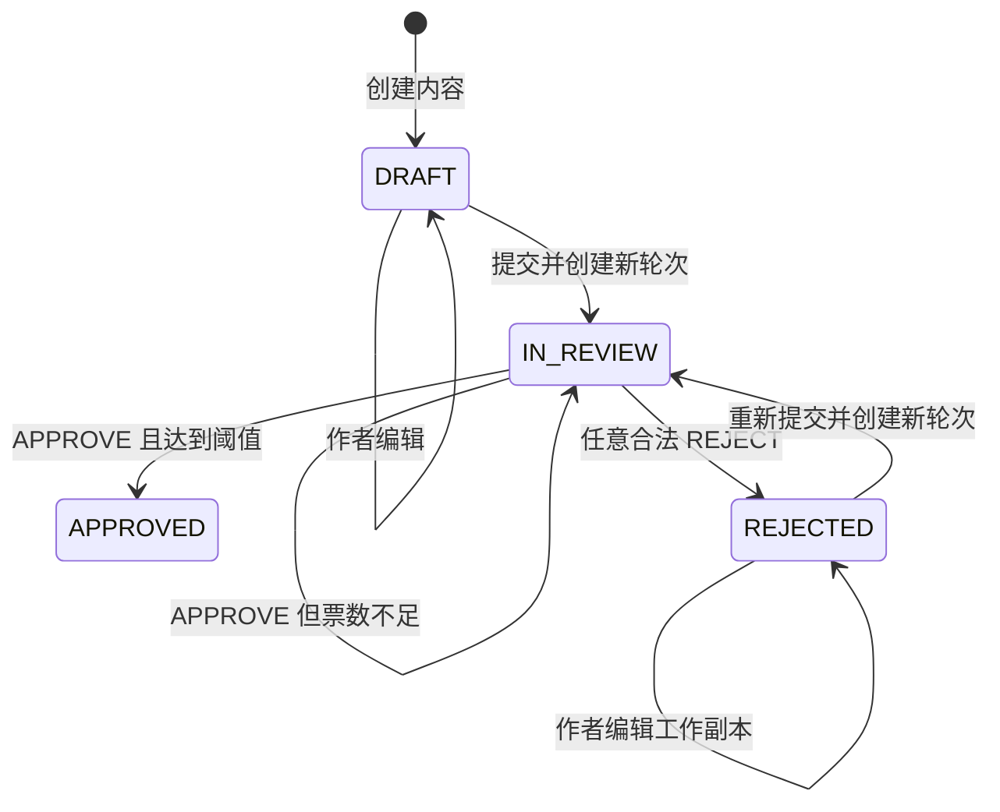
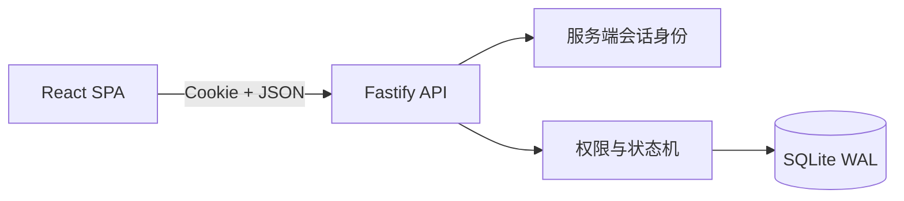

# ReviewFlow

ReviewFlow 是一个内部内容审核系统，重点不是页面数量，而是如何把多角色权限、分级审核、多轮重提、不可变历史、请求幂等和并发终态建模为一组可验证的业务规则。

[在线演示](https://qlili.com/reviewflow/) · [HTML 文档中心](https://qlili.com/reviewflow/docs/) · [系统设计](docs/reviewflow-system-design.md) · [测试方案](docs/reviewflow-test-plan.md)

> 在线环境是公开 Demo。任何访问者都可以切换预置用户并修改演示数据，请勿录入真实或敏感内容。


## 项目重点

ReviewFlow 不是在 `contents` 表上追加一个审核状态的普通 CRUD。系统明确区分四类事实：

- **内容工作副本**：作者在 `DRAFT` 或 `REJECTED` 状态下编辑的当前内容。
- **不可变提交快照**：每次提交保存一份 `content_revision`，历史不会被后续编辑改写。
- **审核轮次**：每次提交创建全新的 `review_round`，风险等级和通过阈值在该轮冻结。
- **审核决定**：审核人只能在一轮中决定一次，历史决定追加保存，不允许修改。

这组模型直接解决了三个容易出错的问题：旧轮次的票不能进入新轮次、审核历史必须展示当时的内容、并发通过与拒绝只能形成一个最终结果。

## 已实现能力

| 领域 | 当前行为 |
| --- | --- |
| 多角色 | 用户可同时拥有多个角色；`ADMIN` 不自动获得 `REVIEWER` 权限 |
| 服务端身份 | 写接口只信任服务端签名 Cookie，不接受客户端指定 actor 或 reviewer |
| 内容编辑 | 只有作者且拥有 `SUBMITTER` 时可编辑；仅 `DRAFT`、`REJECTED` 可编辑 |
| 分级审核 | LOW 需要 1 位审核人通过；HIGH 需要 2 位不同审核人通过 |
| 自审限制 | 作者不能审核自己的内容，即使同时拥有 `REVIEWER` |
| 拒绝规则 | 任意合法拒绝立即结束当前轮次；拒绝理由必须为非空白字符串 |
| 多轮重提 | 拒绝后可编辑并重新提交；旧快照和决定保留，新轮进度从 0 开始 |
| 乐观并发 | 编辑和提交携带 `expectedVersion`，阻止旧标签页覆盖新状态 |
| 请求幂等 | 业务写请求使用 `Idempotency-Key`；相同请求重放，相同 key 不同请求返回 409 |
| 终态一致性 | 决定、轮次终态、内容状态和幂等结果在同一事务中提交或回滚 |

## 角色与演示用户

| 用户 | 角色 | 能力 |
| --- | --- | --- |
| Alice | `SUBMITTER`、`REVIEWER` | 创建和提交自己的内容，也可审核他人内容，但不能自审 |
| Bob | `REVIEWER` | 审核非本人创建的待审内容 |
| Chen | `REVIEWER` | 审核非本人创建的待审内容 |
| Diana | `ADMIN` | 查看所有内容和完整历史，但不能审核 |

用户切换由服务端 `getCurrentUser()` 适配层提供，不是真实登录系统。切换后服务端写入签名、`HttpOnly`、`SameSite=Lax` Cookie，后续接口从 Cookie 恢复当前用户；未选择用户时默认为 Alice。

## 状态流转



`APPROVED` 是当前需求下的终态。`REJECTED` 保留上一轮结果，同时允许作者继续修改工作副本。

## 当前架构



当前交付是一个适合演示和单机部署的模块化单体：

- React 19 + TypeScript + Vite 负责审核工作台。
- Fastify 5 + Zod 负责 API、严格输入校验和服务端权限。
- Node.js 内置 `node:sqlite` + 直接 SQL 负责持久化。
- SQLite 使用 WAL、`busy_timeout` 和 `BEGIN IMMEDIATE` 串行化关键写事务。
- 生产构建由同一个 Fastify 进程提供 API 和静态资源。

### 当前实现与目标设计

仓库中的两类文档有不同定位，请勿混淆：

| 层次 | 数据库与并发 | 验证方式 | 状态 |
| --- | --- | --- | --- |
| 当前可运行 MVP | SQLite WAL、单写事务、单应用实例 | Vitest、Fastify inject、内存 SQLite | 已实现 |
| 完整目标方案 | PostgreSQL、Kysely、`SELECT FOR UPDATE`、数据库账号隔离 | Testcontainers、并发屏障、故障注入、Playwright | 设计与评审基线 |

当前代码没有声称已经使用 PostgreSQL、Kysely、Testcontainers 或 Playwright。需要横向扩容或多实例运行时，应先按[系统设计](docs/reviewflow-system-design.md)迁移到 PostgreSQL，不能直接复制 SQLite 应用实例。

## 快速开始

### 环境要求

- Node.js 22.5 或更高版本
- npm 10 或更高版本

### 安装和启动

```bash
git clone https://github.com/jaxblack/reviewflow.git
cd reviewflow
npm ci
npm run dev
```

开发服务启动后：

- Web：<http://localhost:5173/reviewflow/>
- API：<http://localhost:3001>
- 健康检查：<http://localhost:3001/api/health>
- 默认用户：Alice
- 本地数据：`.data/reviewflow.db`

开发模式提供默认会话密钥，仅用于本地运行。生产环境必须显式设置安全的 `SESSION_SECRET`。

## 验证

运行完整本地门禁：

```bash
npm run check
```

该命令依次执行 lint、Vitest 和生产构建：

```text
npm run lint
npm test
npm run build
```

当前自动化测试覆盖：

- LOW 一票通过，以及 HIGH 两位不同审核人通过。
- 作者自审失败、纯 ADMIN 审核失败、空白拒绝理由失败。
- HIGH 首票后继续审核、任意拒绝终止轮次。
- 拒绝后编辑和重提，旧轮快照不变且不参与新轮计票。
- 相同幂等请求重放，以及相同 key 对应不同请求时冲突。
- LOW 轮次中通过与拒绝并发竞争时只有一个成功终态。
- 48 条演示数据的幂等生成、状态分布和关键数据库不变量。

当前测试使用 Fastify `inject()` 和内存 SQLite。PostgreSQL 行锁、确定性并发屏障、故障注入与浏览器 E2E 的完整规划见[测试方案](docs/reviewflow-test-plan.md)，这些属于后续生产化门禁。

## CI/CD

仓库使用 GitHub Actions 执行两段式流水线：

- **CI**：Pull Request 和 `main` 分支提交均执行 `npm ci`、`npm run check`，随后构建生产 Docker 镜像并启动容器验证 `/api/health`。
- **CD**：只有当前仓库 `main` 分支的 CI 全部成功后才会进入 `production` Environment。流水线构建不可变 release，通过 SSH 上传到腾讯云，原子切换 `current` 软链并重启单实例 systemd 服务；健康检查失败时恢复上一个 release。

生产部署需要先在 GitHub 中为 `production` Environment 配置审批人和部署分支保护，并设置 `PRODUCTION_HOST`、`PRODUCTION_USER`、`PRODUCTION_SSH_PRIVATE_KEY`、`PRODUCTION_SSH_KNOWN_HOSTS`。`SESSION_SECRET` 不经过 CI/CD，仍只保存在服务器的 `shared/reviewflow.env`。完整初始化和密钥配置见[腾讯云单机部署](deploy/tencent-cloud.md)。

当前 SQLite 架构只允许单应用实例，因此 CD 使用短暂停机重启，不执行多副本滚动发布。需要零停机或横向扩容时，应先迁移 PostgreSQL。

## 演示数据

生产构建后可以幂等写入 48 条演示内容：

```bash
npm run build
npm run seed:demo
```

其中包含 9 条核心规则案例和 39 条真实业务语境记录。数据覆盖：

- 草稿。
- LOW/HIGH 待审核。
- LOW/HIGH 已通过。
- 先通过后拒绝。
- 拒绝后修改并重新提交。
- 并发终态示例。
- 账户、支付、隐私、社区、营销、客服、配送和通知等内容类型。

工作台支持队列概览、标题搜索、状态/风险筛选和独立滚动。重复执行种子不会创建重复数据，场景和建议演示顺序见[演示场景](docs/demo-scenarios.md)。

## API 概览

| 方法 | 路径 | 说明 |
| --- | --- | --- |
| `GET` | `/api/health` | 健康检查 |
| `GET` | `/api/users` | 获取预置用户 |
| `GET` | `/api/me` | 获取服务端当前用户 |
| `POST` | `/api/session/switch` | 切换 Demo 用户并写入签名 Cookie |
| `GET` | `/api/contents?scope=mine` | 查看我的内容 |
| `GET` | `/api/contents?scope=all` | ADMIN 查看全部内容 |
| `POST` | `/api/contents` | 创建草稿 |
| `GET` | `/api/contents/:id` | 查看详情和当前审核进度 |
| `PATCH` | `/api/contents/:id` | 编辑自己的 DRAFT/REJECTED 内容 |
| `POST` | `/api/contents/:id/submit` | 创建不可变快照和新审核轮次 |
| `GET` | `/api/contents/:id/history` | 查看完整审核历史 |
| `GET` | `/api/reviews/pending` | 查看待我审核的内容 |
| `POST` | `/api/review-rounds/:id/decisions` | 提交 APPROVE 或 REJECT 决定 |

创建、编辑、提交和审核决定都要求有效的 `Idempotency-Key`。身份、角色、作者关系、状态、版本和轮次会在服务端重新校验，前端按钮只负责改善交互，不构成安全边界。

## 一致性设计

### 不可变历史

`contents` 保存当前工作副本。每次提交在同一事务中创建一条 `content_revisions` 和一条 `review_rounds`；历史查询通过轮次读取对应 revision，不读取后来被编辑的工作副本。

### 数据库防线

- 部分唯一索引保证每条内容最多一个 `OPEN` 轮次。
- 联合唯一约束保证每位审核人在同一轮最多一条决定。
- CHECK 约束保证拒绝理由非空、轮次状态与完成时间一致。
- 外键和 revision 归属检查阻止轮次引用其他内容的快照。

### 幂等与并发

幂等请求按 `(actor_id, operation, idempotency_key)` 保存请求摘要和第一次响应：

- key 和请求都相同：返回第一次状态码和响应体，并设置 `Idempotency-Replayed: true`。
- key 相同但请求不同：返回 `409 IDEMPOTENCY_KEY_REUSED`。
- 事务失败：业务事实和幂等记录一起回滚，客户端可以安全重试。

SQLite 的 `BEGIN IMMEDIATE` 保证关键写事务串行执行。两个请求同时尝试通过或拒绝同一轮时，先提交者决定终态；后续请求重新读取状态并返回 409，不会留下失败方的审核决定。

## Docker

```bash
cp .env.example .env
# 将 .env 中的 SESSION_SECRET 替换为至少 32 字节的随机值
docker compose up -d --build
curl --fail http://127.0.0.1:3000/api/health
```

健康检查应返回：

```json
{"status":"ok","database":"sqlite"}
```

Compose 只把服务绑定到 `127.0.0.1`，用于通过 Caddy 或 Nginx 提供 HTTPS。前端资源的部署基路径是 `/reviewflow/`；反向代理需要剥离此前缀，并设置 `COOKIE_PATH=/reviewflow`。完整步骤见[腾讯云单机部署](deploy/tencent-cloud.md)。

## 环境变量

| 变量 | 默认值 | 说明 |
| --- | --- | --- |
| `SESSION_SECRET` | 仅开发模式有不安全默认值 | 生产环境必填，用于签名用户 Cookie |
| `HOST` | `0.0.0.0` | Fastify 监听地址；反向代理部署建议设为 `127.0.0.1` |
| `PORT` | `3000` | 生产 HTTP 端口 |
| `DATA_DIR` | `.data` | SQLite 文件目录；容器内为 `/data` |
| `COOKIE_SECURE` | `false` | HTTPS 环境设置为 `true` |
| `COOKIE_PATH` | `/` | 子路径部署设置为 `/reviewflow` |
| `REVIEWFLOW_PORT` | `3000` | Compose 映射到宿主机的本地端口 |

## 项目结构

```text
reviewflow/
├── .github/workflows/   # GitHub Actions CI 与生产部署
├── src/                 # React 审核工作台
│   ├── components/      # 内容编辑、详情和状态组件
│   ├── api.ts           # 前端 API 与幂等请求封装
│   └── App.tsx          # 用户切换、队列和详情编排
├── server/              # Fastify API、SQLite schema、事务和测试
├── public/docs/         # 在线 HTML 设计、测试、验收与运行文档
├── docs/                # 架构、设计、评审、测试和演示文档
├── deploy/              # systemd、Caddy、Nginx 与腾讯云部署说明
├── artifacts/           # 桌面与移动端验证截图
├── compose.yaml
└── Dockerfile
```

## 文档导航

| 文档 | 定位 |
| --- | --- |
| [HTML 文档中心](https://qlili.com/reviewflow/docs/) | 在线浏览系统设计、测试报告、验收报告和部署运行说明 |
| [当前实现架构](docs/architecture.md) | SQLite MVP 的状态机、数据模型、一致性和部署边界 |
| [完整系统设计](docs/reviewflow-system-design.md) | PostgreSQL 目标模型、DDL、API、权限、事务与实施顺序 |
| [技术评审方案](docs/reviewflow-technical-review.md) | 评审门禁、检查清单、风险分级、关键链路和结论模板 |
| [测试方案](docs/reviewflow-test-plan.md) | 14 条不变量追踪、集成/并发/故障注入/E2E 用例与退出标准 |
| [演示场景](docs/demo-scenarios.md) | 48 条种子数据、状态分布及角色切换演示顺序 |
| [腾讯云部署](deploy/tencent-cloud.md) | 当前 systemd + Caddy 部署和 Docker 备选方案 |

## AI 辅助交付

本项目使用 AI Coding 工具辅助需求拆解、边界分析、实现、审查和测试设计，但不把 AI 输出本身当作正确性证据。交付过程遵循以下原则：

1. 先从原始需求提取长期不变量和未明确的边界问题。
2. 用内容工作副本、不可变 revision、review round 和 decision 固化领域模型。
3. 按创建/提交、审核、历史和部署进行纵向实现，而不是一次生成完整系统。
4. 用数据库约束、事务和自动化测试验证结论。
5. 单独保留技术评审与测试蓝图，明确当前 MVP 和生产目标之间的差距。

可审查证据包括系统设计、评审方案、测试方案、数据库 schema、API 集成测试、演示 seed 测试和部署材料。

## 假设与限制

- 所有 REVIEWER 共享待审池，不做指派或转派。
- 被拒绝后编辑仍保持 `REJECTED`，重新提交时才进入 `IN_REVIEW`。
- 风险等级可在 `DRAFT` 或 `REJECTED` 状态修改，新轮按提交时风险冻结阈值。
- 被拒绝后允许不修改内容直接重提。
- 已通过内容不能编辑或重新提交。
- 删除、撤回、申诉、通知、SLA 和运行期角色管理不在当前范围内。
- 当前身份切换只用于演示，不具备真实认证系统的安全属性。
- 当前 SQLite 实现只支持单应用实例，不支持横向扩容或滚动多副本部署。
- 当前没有 Testcontainers PostgreSQL 测试和 Playwright E2E；对应方案已经文档化，但不能视为已通过的测试。

更完整的边界决定、数据库升级路线和验收标准见[系统设计](docs/reviewflow-system-design.md)。
