# ReviewFlow

ReviewFlow 是一个内部内容审核系统，重点不是页面数量，而是如何把多角色权限、分级审核、多轮重提、不可变历史、请求幂等和并发终态建模为一组可验证的业务规则。

[在线演示](https://qlili.com/reviewflow/) · [HTML 文档中心](https://qlili.com/reviewflow/docs/) · [系统设计](docs/reviewflow-system-design.md) · [测试方案](docs/reviewflow-test-plan.md)

> 在线环境是公开 Demo。任何访问者都可以切换用户；切换到 Diana 后还可管理演示用户和角色。请勿录入真实或敏感内容。

## 快速导航

| 了解产品 | 开发与验证 |
| --- | --- |
| [项目重点](#项目重点) · [角色与演示用户](#角色与演示用户) | [快速开始](#快速开始) · [验证](#验证) |
| [PC 工作台体验](#pc-工作台体验) · [状态流转](#状态流转) | [CI/CD](#cicd) · [API 概览](#api-概览) |
| [推荐上手路径](#推荐上手路径) · [完整 Ramp-up](#12-分钟-ramp-up走完核心审核流程) | [项目结构](#项目结构) · [文档导航](#文档导航) |
| [当前架构](#当前架构) · [一致性设计](#一致性设计) | [AI 辅助交付](#ai-辅助交付) · [假设与限制](#假设与限制) |

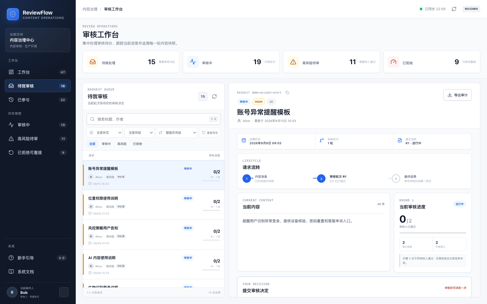

## 项目重点

ReviewFlow 不是在 `contents` 表上追加一个审核状态的普通 CRUD。系统明确区分四类事实：

- **内容工作副本**：作者在 `DRAFT` 或 `REJECTED` 状态下编辑的当前内容。
- **不可变提交快照**：每次提交保存一份 `content_revision`，历史不会被后续编辑改写。
- **审核轮次**：每次提交创建全新的 `review_round`，风险等级和通过阈值在该轮冻结。
- **审核决定**：审核人只能在一轮中决定一次，历史决定追加保存，不允许修改。

这组模型直接解决了三个容易出错的问题：旧轮次的票不能进入新轮次、审核历史必须展示当时的内容、并发通过与拒绝只能形成一个最终结果。

## 已实现能力

| 领域 | 当前行为 |
| --- | --- |
| 多角色 | 用户可同时拥有多个角色；`ADMIN` 不自动获得 `REVIEWER` 权限 |
| 服务端身份 | 写接口只信任服务端签名 Cookie，不接受客户端指定 actor 或 reviewer |
| 企业级工作台 | 深色应用导航、唯一请求清单和审计详情三栏协作；同一内容不因多个语义队列重复出现 |
| 处理效率 | 默认最近更新、可选智能优先级、队列聚焦、快捷筛选、搜索、⌘K 聚焦和方向键切换 |
| 用户与角色 | ADMIN 可在站内创建用户、改名和叠加角色；保护最后一位管理员及开放轮次审核能力 |
| 审计工具 | 详情展示请求 ID、工作副本、轮次进度和不可变时间线，并支持复制 ID 与导出当前可见审计 JSON |
| 内容编辑 | 只有作者且拥有 `SUBMITTER` 时可编辑；编辑器支持“暂存草稿”和“直接提交审核”双路径 |
| 分级审核 | LOW 需要 1 位审核人通过；HIGH 需要 2 位不同审核人通过 |
| 自审限制 | 作者不能审核自己的内容，即使同时拥有 `REVIEWER` |
| 拒绝规则 | 任意合法拒绝立即结束当前轮次；拒绝理由必须为非空白字符串 |
| 多轮重提 | 拒绝后可编辑并重新提交；旧快照和决定保留，新轮进度从 0 开始 |
| 乐观并发 | 编辑和提交携带 `expectedVersion`，阻止旧标签页覆盖新状态 |
| 请求幂等 | 业务写请求使用 `Idempotency-Key`；相同请求重放，相同 key 不同请求返回 409 |
| 终态一致性 | 决定、轮次终态、内容状态和幂等结果在同一事务中提交或回滚 |

## 角色与演示用户

| 用户 | 角色 | 能力 |
| --- | --- | --- |
| Alice | `SUBMITTER`、`REVIEWER` | 创建和提交自己的内容，也可审核他人内容，但不能自审 |
| Bob | `REVIEWER` | 审核非本人创建的待审内容 |
| Chen | `REVIEWER` | 审核非本人创建的待审内容 |
| Diana | `ADMIN` | 查看所有内容和完整历史、管理用户与角色，但不能仅凭 ADMIN 审核 |

用户切换由服务端 `getCurrentUser()` 适配层提供，不是真实登录系统。切换后服务端写入签名、`HttpOnly`、`SameSite=Lax` Cookie，后续接口从 Cookie 恢复当前用户；未选择用户时默认为 Alice。Diana 可从左侧“系统 → 用户与权限”进入管理抽屉，新建用户会立即出现在演示切换入口。

Alice、Bob、Chen、Diana 是预置账号；下拉框中标记为“自定义”的账号来自公开 Demo 操作。例如 `Eva Ramp-up v2` 是验收引导过程中创建的 SUBMITTER + REVIEWER 示例用户，不是系统内置角色或特殊服务账号。

## PC 工作台体验

当前 PC 界面按成熟 ToB 控制台的信息密度和交互模式组织：

- **应用级导航**：角色可见队列、状态快捷视图、新手引导、系统文档、权限管理和当前操作人固定在左侧；当前操作人直接显示中文角色与预置/自定义来源，切换入口使用高对比按钮。
- **唯一请求清单**：工作台、待我审核、我的提交、已参与和管理员全量只是过滤视角；每条内容在当前清单只渲染一次。
- **运营优先级**：默认把高风险待办、普通待办、其他审核中、已拒绝和草稿依次前置，也可切换为更新时间或标题排序。
- **高效定位**：支持组合筛选、快捷条件、始终可见的“重置筛选”、`⌘K` 聚焦搜索，以及方向键在结果间切换。
- **审计详情**：粘性操作栏、请求编号、内容与进度并排展示；R1/R2 等全部轮次默认展开，并支持审计 JSON 导出和明确反馈。
- **输入引导**：标题、正文、审核意见、搜索和用户创建表单都提供场景化占位提示，空表单也能理解预期输入。
- **权限管理抽屉**：ADMIN 可查看成员/角色汇总、搜索成员、创建用户和编辑叠加角色，服务端安全规则保持不变。

本轮界面验收聚焦 PC；已实测 1280×800、1440×900 和 1600×1000，无页面级横向溢出。

## 推荐上手路径

左侧“新手引导”提供 **6 个导航步骤**：它会切换到对应角色、队列和最近更新的目标请求，但不会代替用户提交表单或审核决定。创建草稿和提交审核被拆成两个步骤，用于明确 `DRAFT → IN_REVIEW` 以及首次 revision/round 的产生时点。

要复现从创建到最终 `APPROVED` 的完整 HIGH 闭环，请在引导第 5 步创建 R2 后，再让 Bob、Chen 依次通过 R2，最后使用 Diana 核对两轮历史。在线[验收报告](https://qlili.com/reviewflow/docs/acceptance-report.html#guided-acceptance)将这段终态操作展开为 **7 个业务步骤**。

| 入口 | 适用场景 | 是否执行写操作 |
| --- | --- | --- |
| 左侧“新手引导” | 快速切换角色、定位队列并理解预期结果 | 否，所有保存/提交/审核仍需用户确认 |
| 验收报告 7 步表格 | 从 HIGH 草稿完整走到 R2 `APPROVED` | 按表格手工执行 |
| 下方 18 步 Ramp-up | 同时验证 LOW、HIGH 多轮和 ADMIN 管理 | 按截图逐步执行 |

## 状态流转

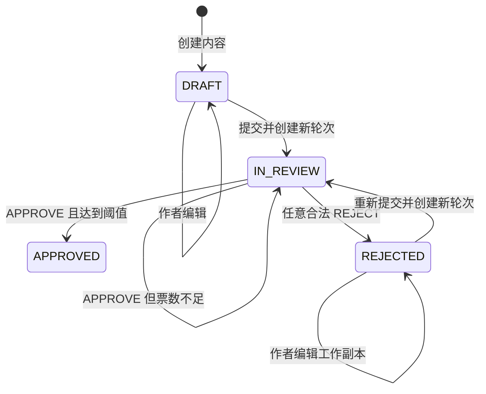

`APPROVED` 是当前需求下的终态。`REJECTED` 保留上一轮结果，同时允许作者继续修改工作副本。

## 当前架构

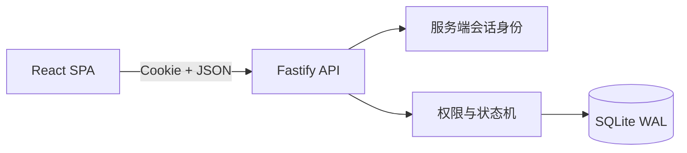

当前交付是一个适合演示和单机部署的模块化单体：

- React 19 + TypeScript + Vite 负责单页全景审核工作台和 ADMIN 管理中心。
- Fastify 5 + Zod 负责 API、严格输入校验和服务端权限。
- Node.js 内置 `node:sqlite` + 直接 SQL 负责持久化。
- SQLite 使用 WAL、`busy_timeout` 和 `BEGIN IMMEDIATE` 串行化关键写事务。
- 生产构建由同一个 Fastify 进程提供 API 和静态资源。

### 当前实现与目标设计

仓库中的两类文档有不同定位，请勿混淆：

| 层次 | 数据库与并发 | 验证方式 | 状态 |
| --- | --- | --- | --- |
| 当前可运行 MVP | SQLite WAL、单写事务、单应用实例 | Vitest、Fastify inject、内存 SQLite | 已实现 |
| 完整目标方案 | PostgreSQL、Kysely、`SELECT FOR UPDATE`、数据库账号隔离 | Testcontainers、并发屏障、故障注入、Playwright | 设计与评审基线 |

当前代码没有声称已经使用 PostgreSQL、Kysely、Testcontainers 或 Playwright。需要横向扩容或多实例运行时，应先按[系统设计](docs/reviewflow-system-design.md)迁移到 PostgreSQL，不能直接复制 SQLite 应用实例。

## 快速开始

### 环境要求

- Node.js 22.5 或更高版本
- npm 10 或更高版本

### 安装和启动

```bash
git clone https://github.com/jaxblack/reviewflow.git
cd reviewflow
npm ci
npm run dev
```

开发服务启动后：

- Web：<http://localhost:5173/reviewflow/>
- API：<http://localhost:3001>
- 健康检查：<http://localhost:3001/api/health>
- 默认用户：Alice
- 本地数据：`.data/reviewflow.db`

开发模式提供默认会话密钥，仅用于本地运行。生产环境必须显式设置安全的 `SESSION_SECRET`。

## 12 分钟 Ramp-up：走完核心审核流程

| 案例 | 核心链路 | 最终断言 |
| --- | --- | --- |
| LOW 一票通过 | Alice 创建并提交 → Bob 通过 | `APPROVED 1/1` |
| HIGH 拒绝重提 | R1 先通过后拒绝 → Alice 修改重提 → R2 双人通过 | R1 历史不变，R2 `APPROVED 2/2` |
| ADMIN 管理 | Diana 查看全量审计并创建多角色用户 | ADMIN 只读审核、可管理角色 |

完整的 18 步截图证据保留在 [`docs/assets/ramp-up/`](docs/assets/ramp-up/)；默认折叠，首次了解系统建议先使用上方“推荐上手路径”。

<details>
<summary><strong>展开完整 18 步操作与截图</strong></summary>

下面不是静态样例，而是 2026-09-17 在[在线 Demo](https://qlili.com/reviewflow/)实际执行并截图的三条长版测试用例。它们覆盖创建、提交、分级审核、拒绝、修改重提、不可变历史，以及 ADMIN 用户与角色管理。当前 PC 工作台的最新视觉基线见文档顶部总览图；在线环境是共享的，队列数字和时间可能变化，复现时建议给标题加上自己的前缀。

### 测试用例 A：LOW 内容一票通过

**测试数据**

| 字段 | 值 |
| --- | --- |
| 作者 | Alice |
| 标题 | `Ramp-up v3｜客服中心营业时间调整` |
| 风险 | `LOW` |
| 正文 | `国庆期间客服中心服务时间调整为每日 09:00–18:00，在线客服入口保持不变。` |
| 审核人 | Bob |
| 预期状态 | `DRAFT → IN_REVIEW (0/1) → APPROVED (1/1)` |

#### 步骤 1：Alice 创建 LOW 内容

切换为 Alice，从页面右上角点击“新建内容”，填写标题和正文并选择 `LOW`。

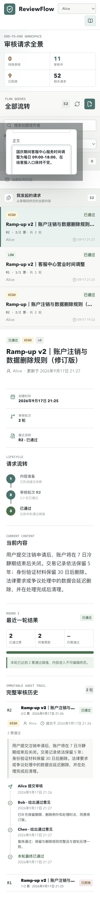

#### 步骤 2：保存草稿

点击“暂存草稿”。预期内容状态为“草稿”，可以继续编辑或提交审核，审核历史为 0 轮。


#### 步骤 3：提交第一轮审核

点击“提交审核”。预期创建 `ROUND 1`，内容变为“审核中”，当前进度为 `0/1`，提交快照进入审核历史。

> 日常操作也可以在创建表单直接点击“直接提交审核”，系统会先保存内容，再立即创建审核轮次；完整验收建议仍按步骤 2、3 分开操作，以观察 `DRAFT → IN_REVIEW`。


#### 步骤 4：Bob 从待审队列打开内容

切换为 Bob，在左侧“待我审核”语义队列打开请求。预期同一页面展示 LOW 风险、作者、请求流转、正文和当前进度，并出现本轮唯一一次的审核决定表单；Alice 作为作者不会在自己的待审队列中看到它。


#### 步骤 5：Bob 通过，内容完成审核

Bob 填写可选意见“营业时间、服务入口和影响范围说明清晰，同意发布。”并点击“通过”。预期内容立即变为“已通过”，进度为 `1/1`，历史记录 Bob 的决定。


### 测试用例 B：HIGH 内容拒绝后修改重提

**测试数据**

| 阶段 | 标题/正文或决定 |
| --- | --- |
| 初稿 | `Ramp-up v3｜账户注销与数据删除规则` |
| 初稿正文 | `用户提交账户注销申请后，我们会处理账户信息和相关数据。` |
| R1 Bob | 通过；建议补充保留数据类型与期限 |
| R1 Chen | 拒绝；缺少保留类型、期限和删除例外 |
| 修订稿 | 标题增加“（修订版）”，正文补充 7 日冷静期、5 年交易记录、30 日身份材料和争议处理例外 |
| R2 Bob / Chen | 两位审核人分别通过 |
| 预期状态 | `DRAFT → R1 1/2 → REJECTED → R2 0/2 → 1/2 → APPROVED 2/2` |

#### 步骤 6：Alice 创建 HIGH 内容

切换为 Alice，创建内容并选择 `HIGH · 两人通过`。初稿故意没有写明数据保留期限和删除例外。

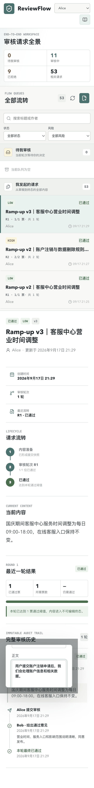

#### 步骤 7：保存 HIGH 草稿

保存后预期状态为“草稿”、风险为 `HIGH`，尚未创建审核轮次。

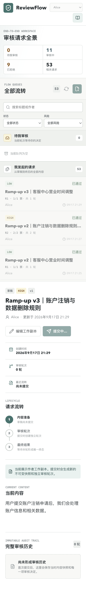

#### 步骤 8：提交第一轮审核

提交后预期进入 `ROUND 1`，进度为 `0/2`。本轮阈值和初稿快照从此冻结。


#### 步骤 9：Bob 给出第一票通过

切换为 Bob，通过该内容并建议补充保留期限。预期内容仍为“审核中”，进度变为 `1/2`，不会因为一票通过提前结束。

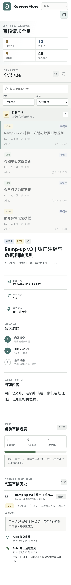

#### 步骤 10：Chen 拒绝第一轮

切换为 Chen，填写非空拒绝理由并点击“拒绝”。预期当前轮次立即结束，内容变为 `REJECTED`；Bob 的通过和 Chen 的拒绝都保留在 R1。

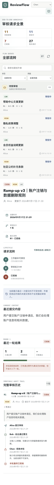

#### 步骤 11：Alice 修改被拒绝内容

切换回 Alice，点击“编辑”，把标题改为“修订版”，并补充保留期限、删除时点和法律例外。

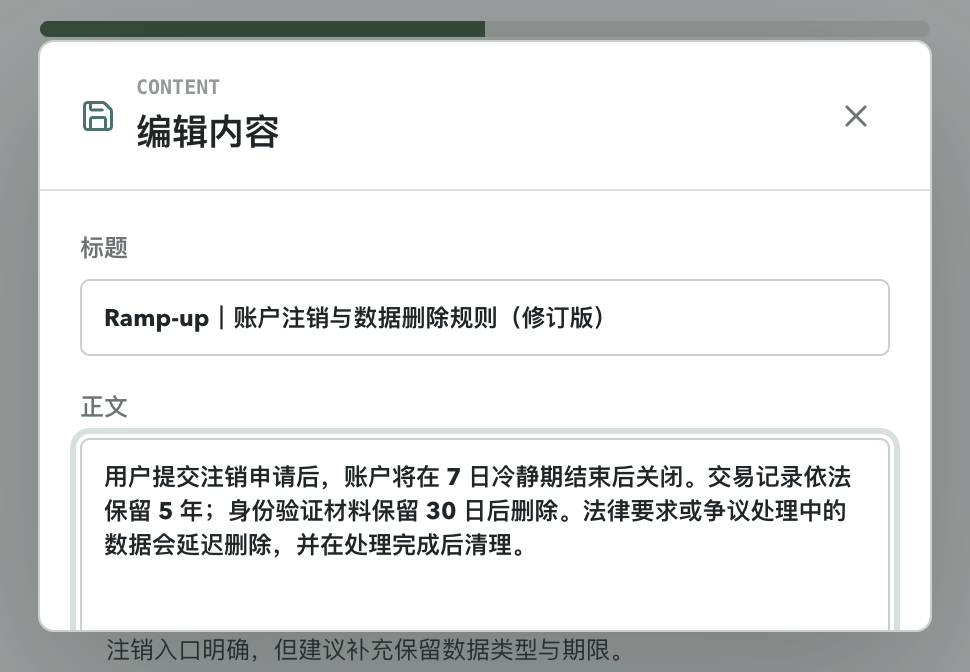

#### 步骤 12：保存修订稿

保存后内容仍为 `REJECTED`，不会自动开始新一轮。工作副本显示修订内容，而 R1 历史仍指向原始标题和原始正文。


#### 步骤 13：重新提交，创建第二轮

点击“重新提交”。预期创建全新的 `ROUND 2`，进度从 `0/2` 开始；统一详情面板同时展示 R2 修订快照和 R1 原始快照，旧轮票数不计入新轮。

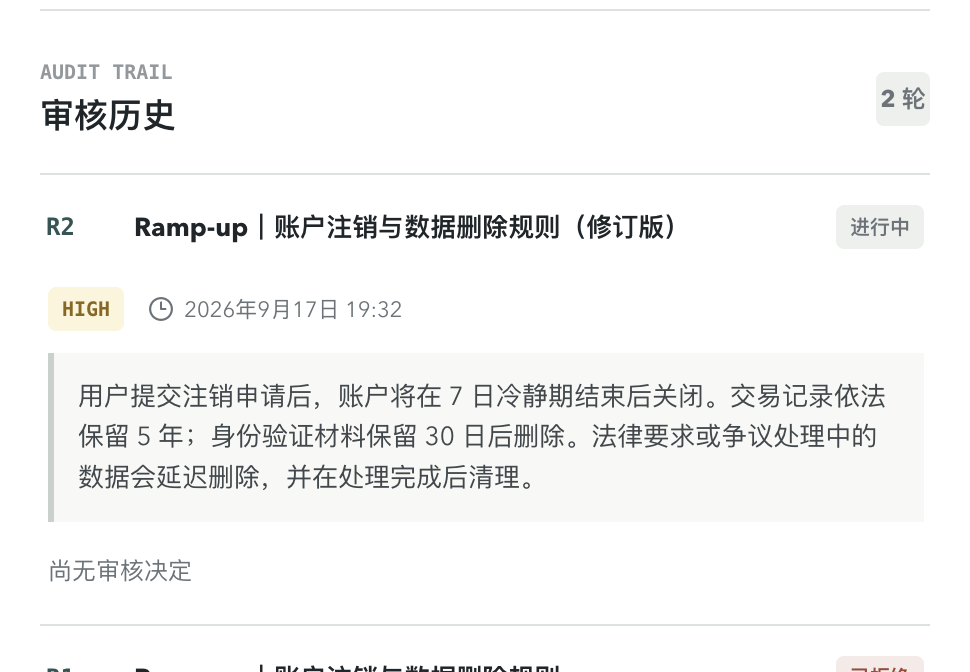

#### 步骤 14：Bob 通过第二轮

Bob 审核修订稿并通过。预期 R2 进度为 `1/2`，内容继续处于“审核中”。

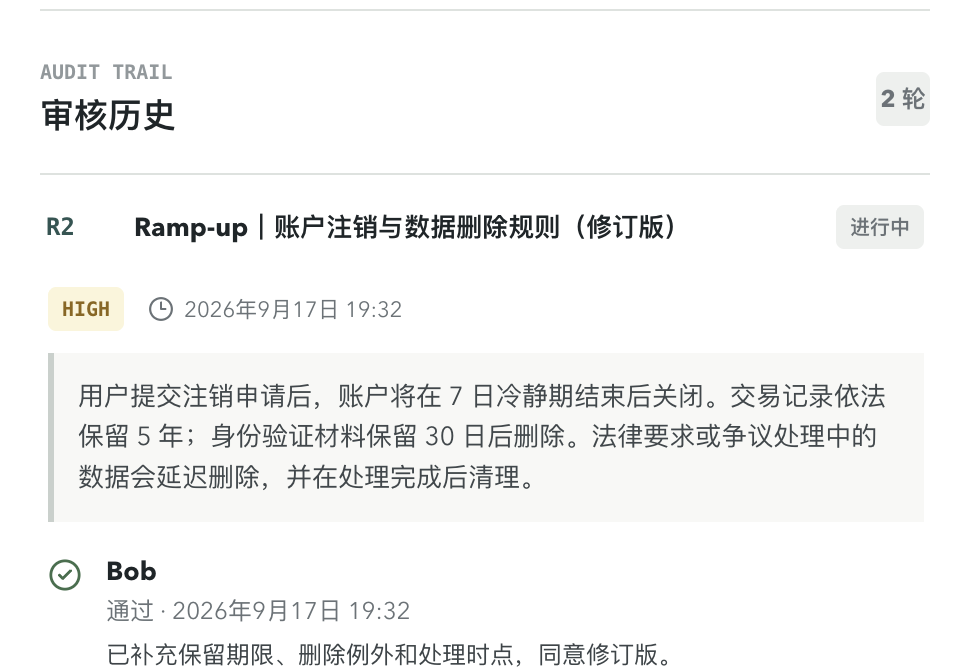

#### 步骤 15：Chen 给出第二票，内容通过

Chen 复核并通过。预期内容成为 `APPROVED`，R2 进度为 `2/2`；R2 显示 Bob、Chen 两位不同审核人的决定，R1 拒绝历史仍然存在。

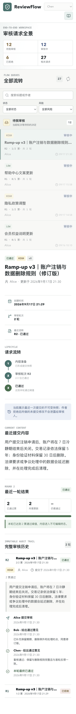

#### 步骤 16：Diana 以 ADMIN 身份核对完整历史

切换为 Diana，在左侧“全部请求”队列搜索该标题。预期可以查看工作副本、R1/R2 快照和四条审核决定，但详情面板不提供“通过”或“拒绝”按钮，因为 `ADMIN` 不自动拥有 `REVIEWER`。

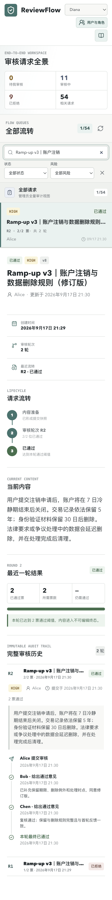

### 测试用例 C：ADMIN 创建多角色用户

#### 步骤 17：Diana 打开用户与角色管理

保持 Diana 身份，点击左侧“系统 → 用户与权限”。预期抽屉展示成员/角色汇总、搜索框、所有用户的内容数、审核数和角色；页面明确提示角色可以叠加、ADMIN 不自动获得审核权限，且用户不能删除以保护审计历史。

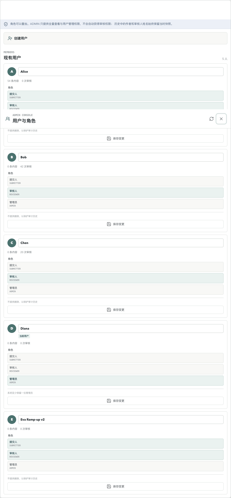

#### 步骤 18：创建同时拥有提交和审核角色的用户

展开“创建用户”，输入 `Eva Ramp-up v2`，同时选择 `SUBMITTER`、`REVIEWER` 并提交。预期新用户立即出现在用户切换入口，角色卡显示两个角色，内容数和审核数均为 0。

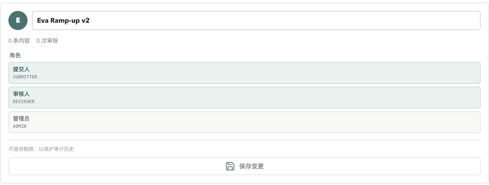

### 完成后的检查点

- LOW 内容只有 Bob 一票，终态为 `APPROVED 1/1`。
- HIGH R1 在 Bob 通过后仍保持 `IN_REVIEW`，Chen 拒绝后立即成为 `REJECTED`。
- 拒绝理由非空，且 R1 的原始标题、正文和两条决定没有被修订稿覆盖。
- HIGH R2 从 `0/2` 重新计票，并由 Bob、Chen 两位不同审核人完成 `2/2`。
- Alice 不能自审；Diana 可以查看全部历史，但不能提交审核决定。
- ADMIN 可以创建和维护多角色用户，但不能删除审计主体，也不能移除系统最后一位管理员。

</details>

## 验证

运行完整本地门禁：

```bash
npm run check
```

该命令依次执行 lint、Vitest、生成文档一致性检查和生产构建：

```text
npm run lint
npm test
npm run docs:check
npm run build
```

当前自动化测试覆盖：

- LOW 一票通过，以及 HIGH 两位不同审核人通过。
- 作者自审失败、纯 ADMIN 审核失败、空白拒绝理由失败。
- HIGH 首票后继续审核、任意拒绝终止轮次。
- 拒绝后编辑和重提，旧轮快照不变且不参与新轮计票。
- 相同幂等请求重放，以及相同 key 对应不同请求时冲突。
- LOW 轮次中通过与拒绝并发竞争时只有一个成功终态。
- 严格 DTO 拒绝客户端伪造身份、状态、票数和审核人字段。
- 旧标签页跨越提交和拒绝后仍因版本过期而无法覆盖工作副本。
- 统一工作区按服务端身份去重并标注我发起、待处理、已参与和 ADMIN 队列。
- ADMIN 用户管理、最后管理员保护，以及撤销审核人不会卡住开放轮次。
- 提交事务中途失败时，快照、轮次和幂等结果整体回滚；同 key 可安全重试。
- 公开写接口的跨路由 IP 限流、用户/内容/轮次/幂等硬配额和过期记录回收。
- 56 条固定演示数据的幂等生成、状态分布和关键数据库不变量，其中 19 条处于开放审核。

当前测试使用 Fastify `inject()` 和内存 SQLite。PostgreSQL 行锁、确定性并发屏障、故障注入与浏览器 E2E 的完整规划见[测试方案](docs/reviewflow-test-plan.md)，这些属于后续生产化门禁。

## CI/CD

仓库使用 GitHub Actions 执行两段式流水线：

- **CI**：Pull Request 和 `main` 分支提交均执行 `npm ci`、`npm run check`，随后构建生产 Docker 镜像并启动容器验证 `/api/health`。
- **CD**：当前仓库 `main` 分支的 CI 全部成功后自动进入 `production` Environment，不再等待人工审批。流水线构建不可变 release，通过 SSH 上传到腾讯云，原子切换 `current` 软链并重启单实例 systemd 服务；健康检查失败时恢复上一个 release。

这里放宽的只有公开 Demo 的**人工审批**。CI 全量门禁、仅同仓库 `main` push 可发布、Environment 分支限制、生产 secrets 隔离、单实例串行发布和失败回滚仍然保留；Workflow 内也注释了这些边界。若接入真实内容或组织身份，应重新启用 required reviewers。

生产部署需要先在 GitHub 中为 `production` Environment 配置 `main` 分支保护，并设置 `PRODUCTION_HOST`、`PRODUCTION_USER`、`PRODUCTION_SSH_PRIVATE_KEY`、`PRODUCTION_SSH_KNOWN_HOSTS`。`SESSION_SECRET` 不经过 CI/CD，仍只保存在服务器的 `shared/reviewflow.env`。完整初始化和密钥配置见[腾讯云单机部署](deploy/tencent-cloud.md)。

当前 SQLite 架构只允许单应用实例，因此 CD 使用短暂停机重启，不执行多副本滚动发布。需要零停机或横向扩容时，应先迁移 PostgreSQL。

## 演示数据

生产构建后可以幂等写入 56 条演示内容：

```bash
npm run build
npm run seed:demo
```

其中包含 9 条核心规则案例和 47 条真实业务语境记录。数据覆盖：

- 草稿。
- LOW/HIGH 待审核。
- LOW/HIGH 已通过。
- 先通过后拒绝。
- 拒绝后修改并重新提交。
- 并发终态示例。
- 账户、支付、隐私、社区、营销、客服、配送和通知等内容类型。

工作台通过固定导航展示当前身份可见的语义队列及数量，中间唯一请求清单默认按最近更新时间排序，新建或刚处理的请求位于首位；也可切换智能优先级、最早更新或标题排序，并支持标题/作者搜索、状态/风险组合筛选和独立滚动。右侧持续展示请求生命周期、当前轮次、不可变历史与审计导出。

## API 概览

| 方法 | 路径 | 说明 |
| --- | --- | --- |
| `GET` | `/api/health` | 健康检查 |
| `GET` | `/api/users` | 获取演示切换入口中的用户 |
| `GET` | `/api/me` | 获取服务端当前用户 |
| `POST` | `/api/session/switch` | 切换 Demo 用户并写入签名 Cookie |
| `GET` | `/api/workspace` | 获取与当前用户相关的去重全景队列 |
| `GET` | `/api/contents?scope=mine` | 查看我的内容 |
| `GET` | `/api/contents?scope=all` | ADMIN 查看全部内容 |
| `POST` | `/api/contents` | 创建草稿 |
| `GET` | `/api/contents/:id` | 查看详情和当前审核进度 |
| `PATCH` | `/api/contents/:id` | 编辑自己的 DRAFT/REJECTED 内容 |
| `POST` | `/api/contents/:id/submit` | 创建不可变快照和新审核轮次 |
| `GET` | `/api/contents/:id/history` | 查看完整审核历史 |
| `GET` | `/api/reviews/pending` | 查看待我审核的内容 |
| `POST` | `/api/review-rounds/:id/decisions` | 提交 APPROVE 或 REJECT 决定 |
| `GET` | `/api/admin/users` | ADMIN 查看用户、角色和业务统计 |
| `POST` | `/api/admin/users` | ADMIN 创建演示用户 |
| `PATCH` | `/api/admin/users/:id` | ADMIN 修改名称和叠加角色 |

创建、编辑、提交、审核决定和用户管理写请求都要求有效的 `Idempotency-Key`。身份、角色、作者关系、状态、版本和轮次会在服务端重新校验，前端按钮只负责改善交互，不构成安全边界。

## 一致性设计

### 不可变历史

`contents` 保存当前工作副本。每次提交在同一事务中创建一条 `content_revisions` 和一条 `review_rounds`；历史查询通过轮次读取对应 revision，不读取后来被编辑的工作副本。

### 数据库防线

- 部分唯一索引保证每条内容最多一个 `OPEN` 轮次。
- 联合唯一约束保证每位审核人在同一轮最多一条决定。
- CHECK 约束保证拒绝理由非空、轮次状态与完成时间一致。
- 外键和 revision 归属检查阻止轮次引用其他内容的快照。

### 幂等与并发

幂等请求按 `(actor_id, operation, idempotency_key)` 保存请求摘要和第一次响应：

- key 和请求都相同：返回第一次状态码和响应体，并设置 `Idempotency-Replayed: true`。
- key 相同但请求不同：返回 `409 IDEMPOTENCY_KEY_REUSED`。
- 事务失败：业务事实和幂等记录一起回滚，客户端可以安全重试。

SQLite 的 `BEGIN IMMEDIATE` 保证关键写事务串行执行。两个请求同时尝试通过或拒绝同一轮时，先提交者决定终态；后续请求重新读取状态并返回 409，不会留下失败方的审核决定。

### 公开 Demo 容量防护

公开环境不能依赖身份切换入口阻止滥用。所有可改变会话或持久化状态的接口共享每 IP 每分钟 30 次写入额度；达到用户、内容、单内容轮次、幂等记录或 SQLite 空间上限后返回 `507 CAPACITY_LIMIT_REACHED`，失败事务不再增长数据库。默认 SQLite 主库硬限 128 MiB，并预留 8 MiB 写入空间。

## Docker

```bash
cp .env.example .env
# 将 .env 中的 SESSION_SECRET 替换为至少 32 字节的随机值
docker compose up -d --build
curl --fail http://127.0.0.1:3000/api/health
```

健康检查应返回：

```json
{"status":"ok","database":"sqlite"}
```

Compose 只把服务绑定到 `127.0.0.1`，用于通过 Caddy 或 Nginx 提供 HTTPS。前端资源的部署基路径是 `/reviewflow/`；反向代理需要剥离此前缀，并设置 `COOKIE_PATH=/reviewflow`。完整步骤见[腾讯云单机部署](deploy/tencent-cloud.md)。

## 环境变量

| 变量 | 默认值 | 说明 |
| --- | --- | --- |
| `SESSION_SECRET` | 仅开发模式有不安全默认值 | 生产环境必填，用于签名用户 Cookie |
| `HOST` | `0.0.0.0` | Fastify 监听地址；反向代理部署建议设为 `127.0.0.1` |
| `PORT` | `3000` | 生产 HTTP 端口 |
| `DATA_DIR` | `.data` | SQLite 文件目录；容器内为 `/data` |
| `COOKIE_SECURE` | `false` | HTTPS 环境设置为 `true` |
| `COOKIE_PATH` | `/` | 子路径部署设置为 `/reviewflow` |
| `REVIEWFLOW_PORT` | `3000` | Compose 映射到宿主机的本地端口 |
| `REVIEWFLOW_WRITE_RATE_LIMIT` | `30` | 同一客户端每分钟共享写入次数 |
| `REVIEWFLOW_MAX_USERS` | `100` | 用户数量硬上限 |
| `REVIEWFLOW_MAX_CONTENTS` | `500` | 内容数量硬上限 |
| `REVIEWFLOW_MAX_ROUNDS_PER_CONTENT` | `20` | 单内容审核轮次硬上限 |
| `REVIEWFLOW_MAX_IDEMPOTENCY_RECORDS` | `2000` | 未过期幂等记录硬上限 |
| `REVIEWFLOW_IDEMPOTENCY_TTL_HOURS` | `24` | 幂等响应保留小时数 |
| `REVIEWFLOW_MAX_DATABASE_BYTES` | `134217728` | SQLite 主库最大字节数 |
| `REVIEWFLOW_DATABASE_RESERVE_BYTES` | `8388608` | 写入停止前保留空间 |

## 项目结构

```text
reviewflow/
├── .github/workflows/   # GitHub Actions CI 与生产部署
├── src/                 # React 审核工作台
│   ├── components/      # 内容编辑、详情和状态组件
│   ├── api.ts           # 前端 API 与幂等请求封装
│   └── App.tsx          # 用户切换、统一队列、详情和管理中心编排
├── server/              # Fastify API、SQLite schema、事务和测试
├── public/docs/         # 自动生成的在线 HTML 文档，不直接编辑
├── docs/                # 架构、设计、评审、测试、演示文档和 PC 截图
│   └── site/            # HTML 页面模板、manifest 与样式源文件
├── scripts/             # HTML 文档静态生成器
├── deploy/              # systemd、Caddy、Nginx 与腾讯云部署说明
├── compose.yaml
└── Dockerfile
```

## 文档导航

| 文档 | 定位 |
| --- | --- |
| [HTML 文档中心](https://qlili.com/reviewflow/docs/) | 在线浏览系统设计、测试报告、验收报告和部署运行说明 |
| [边界与决策](https://qlili.com/reviewflow/docs/edge-cases.html) | 原始歧义、权限可见性、状态版本、并发幂等、角色变化和待确认项 |
| [P0 安全审查](docs/security-review.md) | 公网威胁模型、已修复漏洞、防护边界和残余风险 |
| [HTML 生成与维护](docs/html-documentation.md) | 模板目录、manifest、生成命令、更新流程与故障排查 |
| [当前实现架构](docs/architecture.md) | SQLite MVP 的状态机、数据模型、一致性和部署边界 |
| [完整系统设计](docs/reviewflow-system-design.md) | PostgreSQL 目标模型、DDL、API、权限、事务与实施顺序 |
| [技术评审方案](docs/reviewflow-technical-review.md) | 评审门禁、检查清单、风险分级、关键链路和结论模板 |
| [测试方案](docs/reviewflow-test-plan.md) | 14 条不变量追踪、集成/并发/故障注入/E2E 用例与退出标准 |
| [演示场景](docs/demo-scenarios.md) | 56 条种子数据、状态分布及角色切换演示顺序 |
| [腾讯云部署](deploy/tencent-cloud.md) | 当前 systemd + Caddy 部署和 Docker 备选方案 |

## AI 辅助交付

本项目使用 AI Coding 工具辅助需求拆解、边界分析、实现、审查和测试设计，但不把 AI 输出本身当作正确性证据。交付过程遵循以下原则：

1. 先从原始需求提取长期不变量和未明确的边界问题。
2. 用内容工作副本、不可变 revision、review round 和 decision 固化领域模型。
3. 按创建/提交、审核、历史和部署进行纵向实现，而不是一次生成完整系统。
4. 用数据库约束、事务和自动化测试验证结论。
5. 单独保留技术评审与测试蓝图，明确当前 MVP 和生产目标之间的差距。

可审查证据包括系统设计、评审方案、测试方案、数据库 schema、API 集成测试、演示 seed 测试和部署材料。

## 假设与限制

- 所有 REVIEWER 共享待审池，不做指派或转派。
- 被拒绝后编辑仍保持 `REJECTED`，重新提交时才进入 `IN_REVIEW`。
- 风险等级可在 `DRAFT` 或 `REJECTED` 状态修改，新轮按提交时风险冻结阈值。
- 被拒绝后允许不修改内容直接重提。
- 已通过内容不能编辑或重新提交。
- 用户管理只支持创建、改名和角色分配；不提供删除，以免破坏内容与审核历史引用。
- 系统阻止移除最后一个 ADMIN；撤销 REVIEWER 时会校验剩余票数和未决定审核人，避免卡住开放轮次。
- 删除内容、撤回、申诉、通知和 SLA 不在当前范围内。
- 当前身份切换只用于演示，不具备真实认证系统的安全属性。
- 当前 SQLite 实现只支持单应用实例，不支持横向扩容或滚动多副本部署。
- 当前没有 Testcontainers PostgreSQL 测试和 Playwright E2E；对应方案已经文档化，但不能视为已通过的测试。

更完整的边界决定、数据库升级路线和验收标准见[系统设计](docs/reviewflow-system-design.md)。
