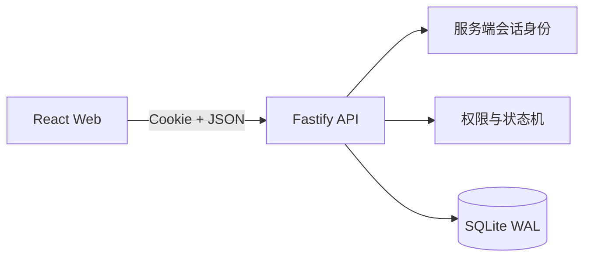
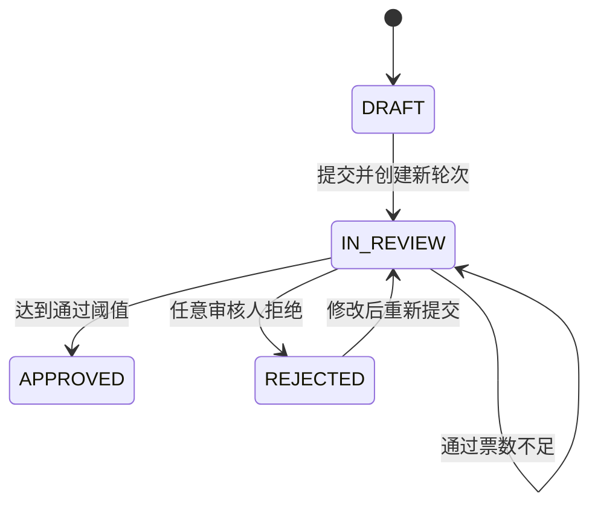
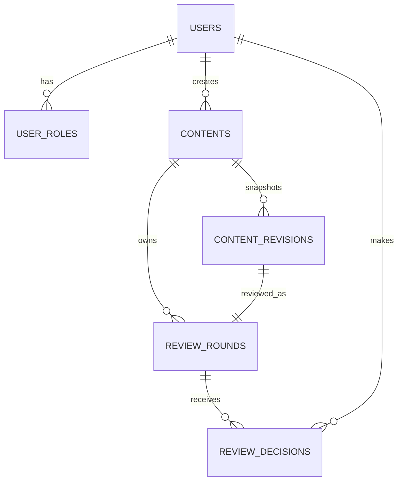

# ReviewFlow 架构说明

## 技术方案

ReviewFlow MVP 使用模块化单体：React SPA、Fastify API 和 Node.js 内置 SQLite。单个 Node 进程同时提供 API 与生产静态资源，适合单机演示和快速部署。

当前实现保持单实例运行。需要多实例时，应先迁移至 PostgreSQL，再使用数据库行锁协调审核终态。

## 状态机

- DRAFT 和 REJECTED 可以编辑。
- IN_REVIEW 和 APPROVED 不可编辑。
- LOW 需要一位审核人通过，HIGH 需要两位不同审核人通过。
- 作者不能审核自己的内容。
- ADMIN 可以查看全部内容，但不会自动获得审核权限。

## 数据模型

`contents` 保存当前工作副本；每次提交产生不可变的 `content_revisions` 快照和新的 `review_rounds`。因此后续编辑不会改变历史轮次所审核的内容。

数据库约束包括：

- 每条内容最多一个 OPEN 轮次。
- 每位审核人在同一轮最多一条决定。
- 拒绝理由必须是非空白字符串。
- 轮次状态和完成时间必须一致。
- revision 必须属于对应内容。

## 一致性

所有写操作在服务端校验身份、角色、作者和状态。客户端不能传入可信的 actor 或 reviewer ID。

SQLite 使用 WAL 和 `BEGIN IMMEDIATE` 串行化写事务。审核决定、轮次终态、内容状态和幂等结果在同一个事务中提交。通过与拒绝同时到达时，先提交的事务决定唯一终态，后续请求返回冲突且不留下决定记录。

每个写请求携带 `Idempotency-Key`：

- 相同键和相同请求返回第一次响应。
- 相同键对应不同请求时返回冲突。
- 数据库唯一约束阻止使用新键重复写入同一审核决定。

## 部署

生产构建由 Fastify 提供，腾讯云实例使用用户级 systemd 保持单实例运行。应用只监听 `127.0.0.1:3000`，Caddy 提供 HTTPS 并将 `/reviewflow/*` 剥离后反向代理到应用。

SQLite 文件位于独立持久化目录，不随 release 替换。生产会话密钥只存放在远端权限为 600 的环境文件中。
