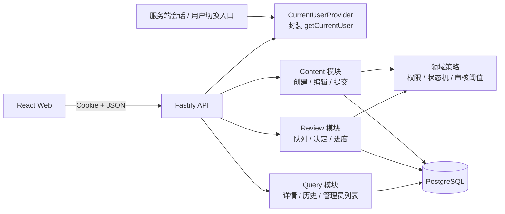
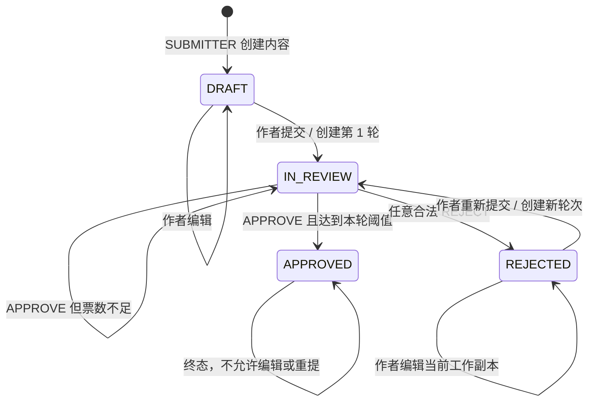
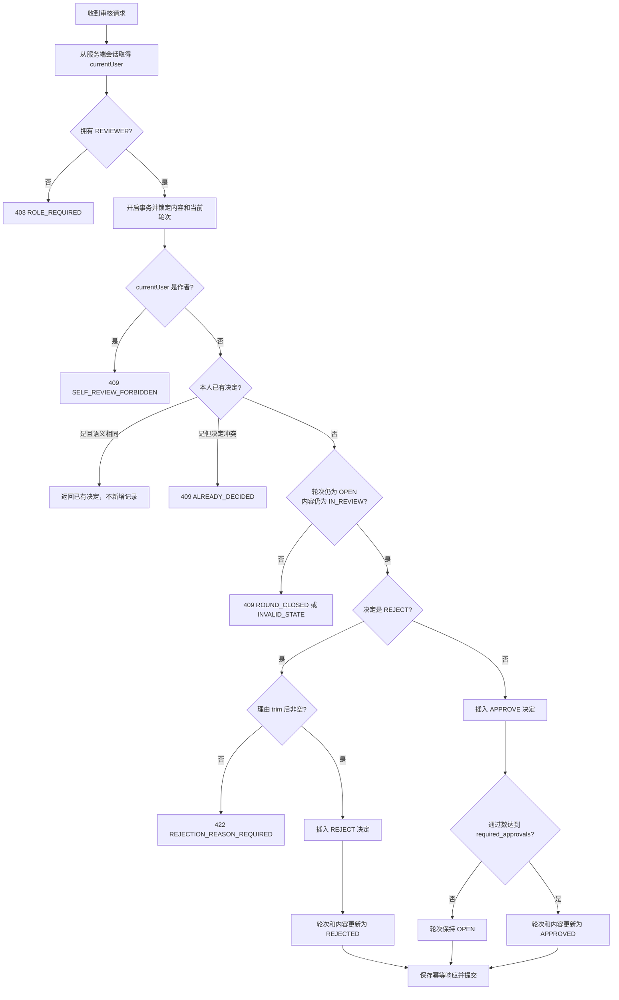
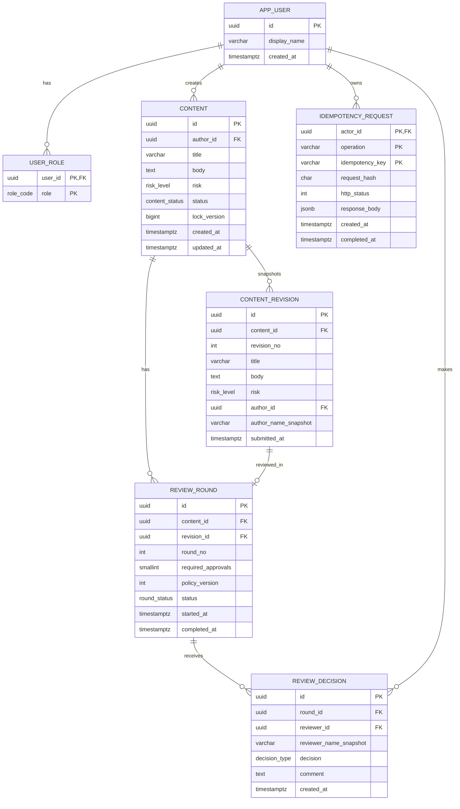
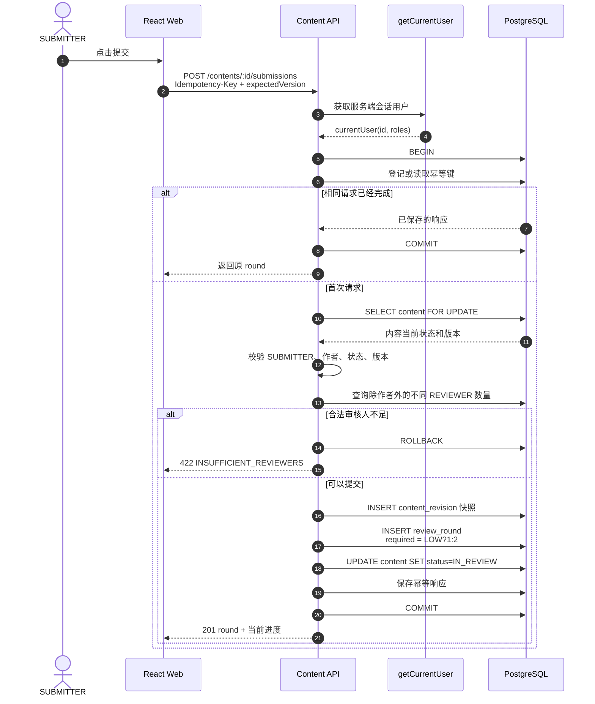
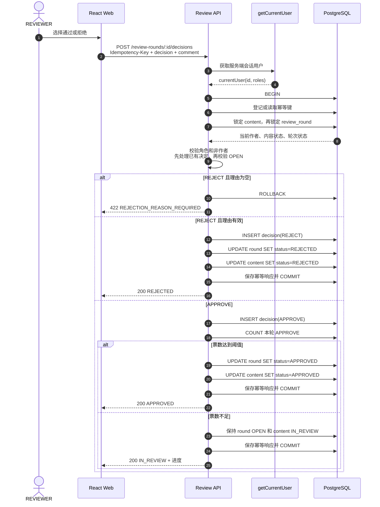
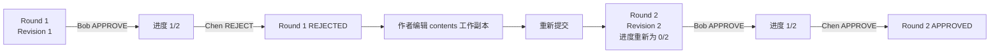
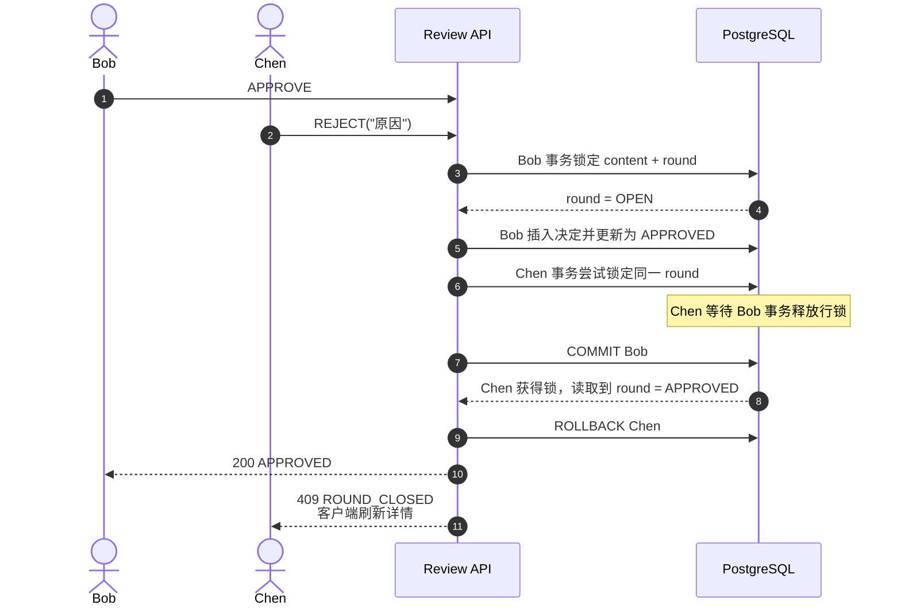

# ReviewFlow 内容审核系统设计方案

> **文档定位**：本文描述面向 PostgreSQL、Kysely 和多实例生产化的完整目标设计。当前仓库交付的是 SQLite 单实例 MVP；已实现架构与差异见 [README](../README.md) 和 [当前实现架构](./architecture.md)。本文中的目标技术栈和测试门禁不能视为已经实现。

## 1. 文档信息

| 项目 | 内容 |
| --- | --- |
| 系统名称 | ReviewFlow |
| 文档类型 | 业务建模与技术设计 |
| 推荐技术栈 | TypeScript、React、Fastify、PostgreSQL、Kysely、Zod |
| 核心目标 | 正确实现多角色、分级审核、多轮审核、不可变历史、幂等和并发一致性 |
| 不在范围内 | 真实登录、用户删除、通知、审核 SLA、内容删除、撤回和申诉 |

本文优先保证业务规则和数据一致性。系统采用模块化单体和单个关系型数据库，不引入微服务、消息队列或事件溯源，避免在当前规模下制造不必要的分布式事务。

---

## 2. 需求摘要

### 2.1 用户和角色

一个用户可以同时拥有多个角色：

- `SUBMITTER`：创建、编辑和提交自己的内容。
- `REVIEWER`：审核其他用户提交的内容。
- `ADMIN`：查看所有内容和审核历史，但不自动获得审核权限。

预置用户：

| 用户 | 角色 | 可以创建 | 可以审核他人内容 | 可以查看所有内容 |
| --- | --- | ---: | ---: | ---: |
| Alice | SUBMITTER、REVIEWER | 是 | 是 | 否 |
| Bob | REVIEWER | 否 | 是 | 否 |
| Chen | REVIEWER | 否 | 是 | 否 |
| Diana | ADMIN | 否 | 否 | 是 |

角色是叠加关系，而不是互斥关系。未来如果 Diana 同时拥有 `ADMIN` 和 `REVIEWER`，她可以凭 `REVIEWER` 身份审核，但仍然不能审核自己创建的内容。

### 2.2 内容状态

- `DRAFT`：草稿，可以编辑和提交。
- `IN_REVIEW`：审核中，不可编辑。
- `APPROVED`：已通过，不可编辑。
- `REJECTED`：已拒绝，可以编辑并重新提交。

### 2.3 必须长期成立的业务不变量

1. 用户身份只来自服务端会话中的 `getCurrentUser()`。
2. 客户端不能指定 `actorId`、`authorId`、`reviewerId`、状态、轮次号或所需票数。
3. 只有内容作者且具有 `SUBMITTER` 角色时，才能编辑或提交该内容。
4. 只有 `DRAFT` 和 `REJECTED` 可以编辑或提交。
5. 每次提交都产生一个新的审核轮次和一份不可变内容快照。
6. 同一条内容最多只能有一个处于 `OPEN` 状态的审核轮次。
7. LOW 风险需要一位不同于作者的审核人通过。
8. HIGH 风险需要两位不同于作者、且彼此不同的审核人通过。
9. 任意合法拒绝都会结束当前轮次，拒绝理由必须为非空白字符串。
10. 同一审核人在同一轮最多存在一条决定。
11. 已结束轮次不能继续写入审核决定。
12. 历史轮次的通过票永远不能计入新轮次。
13. 一轮只能有一个最终结果：`APPROVED` 或 `REJECTED`。
14. 内容状态、轮次状态、审核决定和幂等结果必须在同一数据库事务中提交或回滚。

---

## 3. 需求中的边界问题与设计决定

以下问题在原始需求中没有完全规定。实施前可由产品和业务负责人确认；如果没有进一步说明，采用表中的默认决定。

| 边界问题 | 默认设计决定 | 原因或影响 |
| --- | --- | --- |
| 审核人是否需要被指派 | 不指派，采用公共待审池 | 所有当前合法 REVIEWER 都可处理，模型更符合现有需求 |
| 审核是否盲审 | 不盲审，可以看到当前进度和历史 | 需求明确要求展示当前进度和完整历史 |
| ADMIN 是否能审核 | 只有同时拥有 REVIEWER 才能审核 | ADMIN 不自动拥有审核权限 |
| REVIEWER 是否能审核自己的内容 | 不能，无论还拥有何种角色 | 自审禁令优先于角色叠加 |
| 风险等级能否修改 | 可在 DRAFT/REJECTED 时修改 | 它是内容字段，且这些状态允许编辑 |
| 改风险后采用哪一轮规则 | 新轮次按提交时风险计算，旧轮次规则不变 | 每轮冻结风险和所需票数 |
| 被拒绝后是否必须修改才能重提 | 默认不要求实际字段变化 | 原需求允许修改并重提，但没有明确强制修改 |
| 是否允许撤回审核 | 不允许 | 未给出撤回状态和历史语义 |
| 是否允许修改审核决定 | 不允许，决定为追加式历史 | 否则会破坏审计和并发语义 |
| 是否允许删除内容 | 不允许 | 删除会影响历史完整性，且不在需求范围内 |
| 审核人通过后，另一人还能拒绝吗 | HIGH 风险未达到两票前可以 | 第一票通过不代表本轮结束，后续拒绝会终止本轮 |
| 拒绝后是否删除此前通过票 | 不删除 | 它是本轮真实发生过的历史，只是不再形成通过结果 |
| 第二票通过和拒绝同时到达 | 先获得行锁并提交者决定终态，另一请求返回 409 | 保证只有一个最终结果，不虚构时间顺序 |
| 相同审核请求重试 | 相同幂等键返回第一次响应 | 防止网络重试产生重复记录 |
| 不同幂等键但同一审核人重复操作 | 相同决定返回已有记录，冲突决定返回 409 | 数据库唯一约束作为最终防线 |
| 高风险提交时审核人不足两位 | 提交时返回 422，不创建轮次 | 防止一开始就注定无法完成的审核 |
| 提交后审核人角色被撤销 | 本题预置角色固定，不提供撤销入口 | 若未来支持撤销，必须先验证不会让任何 OPEN 轮次无法完成 |
| 用户改名后历史显示什么 | 决定和快照保存当时的显示名 | 历史展示不随用户资料变化 |
| REVIEWER 完成审核后是否还能查看 | 可以查看自己参与过的内容及其完整历史 | 便于追溯自己的决定 |
| 内容正文是否允许 HTML | 默认按纯文本或 Markdown 处理并转义输出 | 防止存储型 XSS，不直接渲染未经清洗的 HTML |

### 3.1 关于“同时出现已通过和已拒绝”

需要区分“单个审核决定”和“审核轮次最终状态”：

- HIGH 风险轮次中，Bob 先给出 `APPROVE`，Chen 随后给出 `REJECT`，历史里同时存在一条通过决定和一条拒绝决定是合法的。
- 该轮次的唯一最终状态是 `REJECTED`，内容状态也是 `REJECTED`。
- 不允许的是同一轮次最终状态既为 `APPROVED` 又为 `REJECTED`，或者内容状态与轮次最终状态不一致。

### 3.2 关于可见性

默认可见性规则如下：

| 场景 | 是否可查看内容和历史 |
| --- | ---: |
| 内容作者 | 是 |
| ADMIN | 是，所有内容 |
| 当前有资格审核该内容的 REVIEWER | 是 |
| 曾经审核过该内容的 REVIEWER | 是 |
| 其他用户 | 否 |

`待我审核` 比“可查看”更严格，只包括当前轮次为 OPEN、不是本人创建、本人尚未做决定的内容。

---

## 4. 总体架构

### 4.1 技术选型

| 层次 | 推荐方案 | 选择原因 |
| --- | --- | --- |
| Web | React + TypeScript + TanStack Query | 页面数量少，服务端状态和失效刷新处理清晰 |
| API | Fastify + TypeScript + Zod | 边界校验明确，结构轻量，便于测试 |
| 数据访问 | Kysely + `pg` | 保留类型安全，同时可以直接表达事务和 `FOR UPDATE` |
| 数据库 | PostgreSQL | 支持行锁、部分唯一索引、检查约束和可靠事务 |
| 测试 | Vitest + Testcontainers + Playwright | 用真实 PostgreSQL 验证并发和约束 |
| API 契约 | OpenAPI | 明确请求字段，拒绝客户端传入身份或状态字段 |

### 4.2 架构图



身份切换入口只修改服务端会话。前端即使显示当前用户名，也不能把该用户名或用户 ID 当成写操作的可信身份。

### 4.3 推荐目录

```text
reviewflow/
├── apps/
│   ├── api/
│   │   └── src/modules/{auth,content,review,query}/
│   └── web/
│       └── src/features/{contents,reviews,admin}/
├── packages/
│   └── contracts/
├── db/
│   ├── migrations/
│   └── seeds/
├── tests/
│   ├── integration/
│   ├── concurrency/
│   └── e2e/
└── docs/
    ├── assumptions.md
    ├── architecture.md
    └── ai-usage.md
```

---

## 5. 领域模型和状态流转

### 5.1 内容状态机



`APPROVED` 在当前需求中是终态。`REJECTED` 不是终态，它同时表示“上一轮已经拒绝”和“当前工作副本可以继续修改”。

### 5.2 审核规则决策表

| 风险 | 当前轮已有通过数 | 本次决定 | 轮次结果 | 内容状态 |
| --- | ---: | --- | --- | --- |
| LOW | 0 | APPROVE | APPROVED | APPROVED |
| LOW | 0 | REJECT | REJECTED | REJECTED |
| HIGH | 0 | APPROVE | 继续 OPEN，进度 1/2 | IN_REVIEW |
| HIGH | 0 | REJECT | REJECTED | REJECTED |
| HIGH | 1 | APPROVE，且审核人不同 | APPROVED | APPROVED |
| HIGH | 1 | REJECT | REJECTED | REJECTED |

审核阈值读取 `review_rounds.required_approvals`，而不是每次根据 `contents.risk_level` 重新计算。这样即使以后修改策略，历史轮次也不会变化。

### 5.3 审核决定流程图



---

## 6. 数据库设计

### 6.1 ER 图



### 6.2 为什么同时需要 `contents` 和 `content_revisions`

`contents` 保存当前工作副本，用于 DRAFT/REJECTED 编辑；`content_revisions` 保存每次提交时的不可变快照。

示例：

1. Alice 提交标题 A，产生 revision 1 和 round 1。
2. round 1 被拒绝。
3. Alice 把标题改为 B，此时 `contents.title = B`，但 revision 1 仍为 A。
4. Alice 重新提交，产生 revision 2 和 round 2。
5. 历史页面查看 round 1 时展示 A，查看 round 2 时展示 B。

如果审核轮次直接引用 `contents` 的可变字段，第三步会篡改第一轮所看到的内容，违反历史准确性要求。

### 6.3 PostgreSQL DDL 草案

下面的 DDL 展示关键表、检查约束和索引。生产实现可以拆分为多份 migration。

```sql
CREATE EXTENSION IF NOT EXISTS pgcrypto;

CREATE TYPE role_code AS ENUM ('SUBMITTER', 'REVIEWER', 'ADMIN');
CREATE TYPE risk_level AS ENUM ('LOW', 'HIGH');
CREATE TYPE content_status AS ENUM (
    'DRAFT',
    'IN_REVIEW',
    'APPROVED',
    'REJECTED'
);
CREATE TYPE round_status AS ENUM ('OPEN', 'APPROVED', 'REJECTED');
CREATE TYPE decision_type AS ENUM ('APPROVE', 'REJECT');

CREATE TABLE app_users (
    id uuid PRIMARY KEY DEFAULT gen_random_uuid(),
    display_name varchar(100) NOT NULL,
    created_at timestamptz NOT NULL DEFAULT now(),
    CONSTRAINT app_users_display_name_not_blank
        CHECK (btrim(display_name) <> '')
);

CREATE TABLE user_roles (
    user_id uuid NOT NULL REFERENCES app_users(id) ON DELETE RESTRICT,
    role role_code NOT NULL,
    PRIMARY KEY (user_id, role)
);

CREATE TABLE contents (
    id uuid PRIMARY KEY DEFAULT gen_random_uuid(),
    author_id uuid NOT NULL REFERENCES app_users(id) ON DELETE RESTRICT,
    title varchar(200) NOT NULL,
    body text NOT NULL,
    risk risk_level NOT NULL,
    status content_status NOT NULL DEFAULT 'DRAFT',
    lock_version bigint NOT NULL DEFAULT 1,
    created_at timestamptz NOT NULL DEFAULT now(),
    updated_at timestamptz NOT NULL DEFAULT now(),
    CONSTRAINT contents_title_not_blank CHECK (btrim(title) <> ''),
    CONSTRAINT contents_body_not_blank CHECK (btrim(body) <> ''),
    CONSTRAINT contents_lock_version_positive CHECK (lock_version > 0),
    CONSTRAINT contents_time_order CHECK (updated_at >= created_at)
);

CREATE TABLE content_revisions (
    id uuid PRIMARY KEY DEFAULT gen_random_uuid(),
    content_id uuid NOT NULL REFERENCES contents(id) ON DELETE RESTRICT,
    revision_no integer NOT NULL,
    title varchar(200) NOT NULL,
    body text NOT NULL,
    risk risk_level NOT NULL,
    author_id uuid NOT NULL REFERENCES app_users(id) ON DELETE RESTRICT,
    author_name_snapshot varchar(100) NOT NULL,
    submitted_at timestamptz NOT NULL DEFAULT now(),
    CONSTRAINT content_revisions_number_positive CHECK (revision_no > 0),
    CONSTRAINT content_revisions_title_not_blank CHECK (btrim(title) <> ''),
    CONSTRAINT content_revisions_body_not_blank CHECK (btrim(body) <> ''),
    CONSTRAINT content_revisions_unique_number
        UNIQUE (content_id, revision_no),
    CONSTRAINT content_revisions_composite_identity
        UNIQUE (id, content_id)
);

CREATE TABLE review_rounds (
    id uuid PRIMARY KEY DEFAULT gen_random_uuid(),
    content_id uuid NOT NULL REFERENCES contents(id) ON DELETE RESTRICT,
    revision_id uuid NOT NULL UNIQUE,
    round_no integer NOT NULL,
    required_approvals smallint NOT NULL,
    policy_version integer NOT NULL DEFAULT 1,
    status round_status NOT NULL DEFAULT 'OPEN',
    started_at timestamptz NOT NULL DEFAULT now(),
    completed_at timestamptz,
    CONSTRAINT review_rounds_revision_belongs_to_content
        FOREIGN KEY (revision_id, content_id)
        REFERENCES content_revisions(id, content_id)
        ON DELETE RESTRICT,
    CONSTRAINT review_rounds_unique_number UNIQUE (content_id, round_no),
    CONSTRAINT review_rounds_number_positive CHECK (round_no > 0),
    CONSTRAINT review_rounds_required_approvals
        CHECK (required_approvals IN (1, 2)),
    CONSTRAINT review_rounds_policy_version_positive CHECK (policy_version > 0),
    CONSTRAINT review_rounds_completion_consistent CHECK (
        (status = 'OPEN' AND completed_at IS NULL)
        OR
        (status IN ('APPROVED', 'REJECTED') AND completed_at IS NOT NULL)
    )
);

CREATE UNIQUE INDEX review_rounds_one_open_per_content
    ON review_rounds (content_id)
    WHERE status = 'OPEN';

CREATE TABLE review_decisions (
    id uuid PRIMARY KEY DEFAULT gen_random_uuid(),
    round_id uuid NOT NULL REFERENCES review_rounds(id) ON DELETE RESTRICT,
    reviewer_id uuid NOT NULL REFERENCES app_users(id) ON DELETE RESTRICT,
    reviewer_name_snapshot varchar(100) NOT NULL,
    decision decision_type NOT NULL,
    comment text,
    created_at timestamptz NOT NULL DEFAULT now(),
    CONSTRAINT review_decisions_one_per_reviewer
        UNIQUE (round_id, reviewer_id),
    CONSTRAINT review_decisions_reject_reason_required CHECK (
        decision <> 'REJECT'
        OR (comment IS NOT NULL AND btrim(comment) <> '')
    )
);

CREATE TABLE idempotency_requests (
    actor_id uuid NOT NULL REFERENCES app_users(id) ON DELETE RESTRICT,
    operation varchar(100) NOT NULL,
    idempotency_key varchar(100) NOT NULL,
    request_hash char(64) NOT NULL,
    http_status integer,
    response_body jsonb,
    created_at timestamptz NOT NULL DEFAULT now(),
    completed_at timestamptz,
    PRIMARY KEY (actor_id, operation, idempotency_key),
    CONSTRAINT idempotency_requests_result_consistent CHECK (
        (completed_at IS NULL AND http_status IS NULL AND response_body IS NULL)
        OR
        (completed_at IS NOT NULL AND http_status IS NOT NULL AND response_body IS NOT NULL)
    )
);

CREATE INDEX contents_by_author_updated
    ON contents (author_id, updated_at DESC);

CREATE INDEX contents_by_status_updated
    ON contents (status, updated_at DESC);

CREATE INDEX review_rounds_history
    ON review_rounds (content_id, round_no DESC);

CREATE INDEX review_rounds_open_queue
    ON review_rounds (started_at, content_id)
    WHERE status = 'OPEN';

CREATE INDEX review_decisions_by_round_time
    ON review_decisions (round_id, created_at);

CREATE INDEX idempotency_requests_cleanup
    ON idempotency_requests (created_at);
```

### 6.4 约束分层

并不是所有规则都适合写成单表 `CHECK`。建议按以下层次落实：

| 规则 | API Schema | 应用服务 | 数据库 |
| --- | ---: | ---: | ---: |
| 不接受 actorId/reviewerId/status | 是 | 是 | 不适用 |
| 用户具有所需角色 | 否 | 是 | 角色表提供事实 |
| 作者不能自审 | 否 | 是 | 集成测试保护 |
| 只有 DRAFT/REJECTED 可编辑 | 否 | 是，条件 UPDATE | 状态作为条件 |
| 每条内容只有一个 OPEN 轮次 | 否 | 是 | 部分唯一索引 |
| 每位审核人每轮一次决定 | 否 | 是 | 联合唯一约束 |
| 拒绝理由非空 | 是 | 是 | CHECK 约束 |
| LOW/HIGH 所需票数 | 否 | 是，提交时冻结 | CHECK 限制为 1 或 2 |
| 达到票数才通过 | 否 | 是，在行锁内计算 | 同事务更新 |
| 状态与历史原子提交 | 否 | 是 | PostgreSQL 事务 |
| 历史内容不可变 | 否 | 是，无更新接口 | 表权限或代码约束 |

可以增加数据库触发器强制“作者不能自审”，但它是跨表业务规则，会让迁移和测试更复杂。本方案将它放在唯一的审核命令服务中，并用真实数据库集成测试覆盖。所有审核写入必须经过该服务。

### 6.5 数据库访问边界

应用服务是正常业务写入的唯一入口，部署时必须把这个信任边界落实为独立数据库账号：

- `reviewflow_owner`：无日常登录能力，只由 migration 流程使用，拥有 DDL 权限。
- `reviewflow_app`：凭据只注入 API 服务，拥有业务所需的 SELECT/INSERT/UPDATE，不拥有 DDL 和修改角色权限。
- `reviewflow_readonly`：提供给排障和报表，只拥有 SELECT。
- 撤销 `PUBLIC` 的表写权限，不允许管理脚本或后台页面复用 `reviewflow_app` 凭据。
- `content_revisions` 和 `review_decisions` 没有业务 UPDATE/DELETE 路径；代码审查和集成测试必须阻止新增旁路写入。

在当前 MVP 的威胁模型中，数据库位于 API 之后，跨表状态规则由一个事务命令服务控制。如果未来存在多个写服务、人工 SQL 写入或更强的合规要求，应将“提交”和“审核决定”下沉为两个 `SECURITY DEFINER` 存储过程，并撤销运行账号对 `content_revisions`、`review_rounds`、`review_decisions` 的直接 DML 权限。仅增加部分触发器不足以保证决定、轮次和内容状态总是一起更新，容易形成虚假的安全感。

### 6.6 角色变化策略

当前实现提供受限的运行期用户与角色管理：ADMIN 可以创建用户、修改显示名并叠加 `SUBMITTER`、`REVIEWER`、`ADMIN`，但不提供用户删除。删除会破坏内容作者和审核决定的审计引用。

系统必须阻止移除最后一位 ADMIN。删除 `REVIEWER` 前还必须在同一事务中检查每个 OPEN 轮次：

```text
remainingApprovals = requiredApprovals - currentApprovalCount
remainingEligibleReviewers =
    REVIEWER 用户
    - 内容作者
    - 本轮已经做过决定的用户
    - 正在被撤销 REVIEWER 的用户

只有 remainingEligibleReviewers >= remainingApprovals 时才允许撤销角色。
```

已有合法决定继续计票，已决定用户不再属于“剩余审核人”。若检查失败，返回 `409 ROLE_CHANGE_WOULD_BLOCK_OPEN_ROUND`，管理员必须先增加其他 REVIEWER 或等待当前轮次结束。用户改名不回写 `content_revisions.author_name_snapshot` 或 `review_decisions.reviewer_name_snapshot`。

### 6.7 预置数据

```text
Alice -> SUBMITTER, REVIEWER
Bob   -> REVIEWER
Chen  -> REVIEWER
Diana -> ADMIN
```

种子脚本应使用固定 UUID，确保自动化测试和演示环境结果稳定。

---

## 7. 核心业务流程

### 7.1 创建和编辑

创建请求只允许包含：

```json
{
  "title": "内容标题",
  "body": "内容正文",
  "risk": "LOW"
}
```

服务端把 `author_id` 设置为 `currentUser.id`，状态设置为 `DRAFT`。请求中出现 `authorId` 或 `status` 时，严格 Schema 应直接返回 400，而不是静默忽略。

编辑采用乐观锁：

```sql
UPDATE contents
SET title = $1,
    body = $2,
    risk = $3,
    lock_version = lock_version + 1,
    updated_at = now()
WHERE id = $4
  AND author_id = $5
  AND status IN ('DRAFT', 'REJECTED')
  AND lock_version = $6
RETURNING *;
```

更新行数为 0 时重新读取数据并区分：无权限返回 403、状态冲突或版本过期返回 409、内容不存在返回 404。

### 7.2 提交时序图



轮次号和 revision 号都在内容行锁内使用 `MAX(...) + 1` 计算，因此同一内容不会并发生成相同序号。数据库唯一约束提供第二层保护。

可用审核人数必须排除作者，并按不同用户计数：

```sql
SELECT count(DISTINCT ur.user_id)
FROM user_roles ur
WHERE ur.role = 'REVIEWER'
    AND ur.user_id <> :author_id;
```

LOW 至少需要 1 人，HIGH 至少需要 2 人。不能只统计 `REVIEWER` 角色行数，否则 Alice 同时是作者和 REVIEWER 时会被错误地算作可审核人。

### 7.3 审核时序图



### 7.4 被拒绝后重新提交



Round 1 的所有决定继续存在，但 Round 2 统计只查询 `round_id = Round 2` 的决定。

---

## 8. 并发、一致性和幂等

### 8.1 事务锁策略

使用 PostgreSQL 默认的 `READ COMMITTED` 加显式行锁即可。所有写命令遵循固定锁顺序，降低死锁风险：

1. 幂等请求行。
2. `contents` 行。
3. `review_rounds` 行。

审核命令的核心伪代码：

```text
currentUser = getCurrentUser(request)

transaction:
  claimOrReplayIdempotencyKey(currentUser.id, operation, key, requestHash)
  content = SELECT ... FOR UPDATE
  round   = SELECT ... FOR UPDATE

  validateRoleAndOwnership(currentUser, content)
  validateCurrentOpenRound(content, round)
  validateNoPriorDecision(round, currentUser)
  validateDecisionPayload(input)

  INSERT review_decision

  if decision == REJECT:
      close round as REJECTED
      set content to REJECTED
  else if approvalCount(round) >= round.requiredApprovals:
      close round as APPROVED
      set content to APPROVED

  saveIdempotentResponse()
commit
```

所有能修改轮次的代码只能通过该命令服务执行。终态更新还应使用 `WHERE status = 'OPEN'` 并断言恰好更新一行，形成额外的比较并交换保护。

### 8.2 终审通过和拒绝并发时序

下图适用于 LOW 风险的“通过 vs 拒绝”，也适用于 HIGH 风险已有一票后的“第二票通过 vs 拒绝”。谁先取得锁并提交是不确定的，但最终结果始终唯一。



如果 Chen 先获得锁，则结果对称地变为 `REJECTED`，Bob 返回 409。数据库中不会同时出现两个终态，也不会写入失败方的决定。

### 8.3 两位审核人同时通过 HIGH 风险内容

两个请求仍然串行进入临界区：

1. 第一个审核人插入通过决定，计数为 1，轮次保持 OPEN。
2. 第二个审核人获得锁后插入通过决定，计数为 2，将轮次和内容设为 APPROVED。
3. 两条决定都保留，最终结果只有 APPROVED。

### 8.4 同一审核人重复请求

存在两层保护：

- API 层要求 `Idempotency-Key`。同一个键和相同请求摘要直接返回第一次响应。
- 数据库的 `UNIQUE(round_id, reviewer_id)` 保证即使客户端错误地产生了新键，也无法产生第二条决定。

若同一审核人第二次提交相同决定，可以返回已有记录并标记 `replayed: true`；若第二次试图把 APPROVE 改为 REJECT，则返回 `409 ALREADY_DECIDED`。

### 8.5 幂等键处理

客户端在用户点击操作时生成一次 UUID，并在超时重试时复用。服务端使用以下范围唯一：

```text
(current_user_id, operation, idempotency_key)
```

`request_hash` 对 HTTP 方法、路径参数和规范化请求体计算 SHA-256：

- 键相同、摘要相同：返回已保存的 HTTP 状态码和响应体。
- 键相同、摘要不同：返回 `409 IDEMPOTENCY_KEY_REUSED`。
- 首次请求失败并回滚：幂等记录也回滚，重试可以重新执行。
- 业务提交成功但网络响应丢失：重试读取已保存结果，不再执行业务写入。

### 8.6 为什么不只依赖前端禁用按钮

禁用按钮只能改善交互，不能防止：

- 用户直接调用 API。
- 浏览器多标签页同时操作。
- 网络层自动重试。
- 两名审核人同时操作。
- 旧页面提交过期数据。

因此所有角色、作者、状态、轮次、历史决定和版本检查都必须在服务端事务内完成。

---

## 9. API 设计

### 9.1 API 列表

| 方法 | 路径 | 权限 | 用途 |
| --- | --- | --- | --- |
| GET | `/api/me` | 已建立会话 | 返回服务端当前用户和角色 |
| GET | `/api/workspace` | 已建立会话 | 返回当前用户相关的去重全景队列及队列归属 |
| GET | `/api/contents?scope=mine` | SUBMITTER | 我的内容 |
| POST | `/api/contents` | SUBMITTER | 创建草稿 |
| GET | `/api/contents/:id` | 按可见性规则 | 内容详情、当前进度 |
| PATCH | `/api/contents/:id` | 作者 + SUBMITTER | 编辑 DRAFT/REJECTED |
| POST | `/api/contents/:id/submissions` | 作者 + SUBMITTER | 创建新 revision 和 round |
| GET | `/api/reviews/pending` | REVIEWER | 待我审核 |
| POST | `/api/review-rounds/:id/decisions` | REVIEWER 且非作者 | 通过或拒绝 |
| GET | `/api/contents/:id/history` | 按可见性规则 | 完整审核历史 |
| GET | `/api/admin/contents` | ADMIN | 查看所有内容 |
| GET | `/api/admin/users` | ADMIN | 查看用户、角色及关联业务统计 |
| POST | `/api/admin/users` | ADMIN | 创建用户并分配一个或多个角色 |
| PATCH | `/api/admin/users/:id` | ADMIN | 修改显示名和角色集合 |

所有列表 API 都需要分页，推荐游标分页；排序使用 `(updated_at, id)` 或 `(started_at, id)` 保证稳定。

### 9.2 写请求结构

编辑内容：

```json
{
  "title": "新标题",
  "body": "新正文",
  "risk": "HIGH",
  "expectedVersion": 3
}
```

提交内容：

```json
{
  "expectedVersion": 4
}
```

审核决定：

```json
{
  "decision": "REJECT",
  "comment": "包含未经授权的个人信息"
}
```

通过意见可省略：

```json
{
  "decision": "APPROVE"
}
```

### 9.3 服务端返回的能力字段

详情 API 可以返回服务端计算的能力，供前端决定展示哪些操作：

```json
{
  "capabilities": {
    "canEdit": false,
    "canSubmit": false,
    "canReview": true,
    "canViewHistory": true
  }
}
```

能力字段只是 UI 提示。执行 PATCH、提交或审核时，API 必须重新读取服务端身份和数据库状态，不能相信旧响应。

### 9.4 错误语义

| HTTP | 业务错误码 | 示例 |
| ---: | --- | --- |
| 400 | `INVALID_REQUEST` | 请求含未知字段或枚举非法 |
| 401 | `UNAUTHENTICATED` | 服务端会话不存在 |
| 403 | `ROLE_REQUIRED` | Bob 尝试创建内容 |
| 403 | `CONTENT_NOT_VISIBLE` | 用户读取无权查看的内容 |
| 404 | `CONTENT_NOT_FOUND` | 内容不存在 |
| 409 | `INVALID_STATE` | 编辑 IN_REVIEW 内容 |
| 409 | `STALE_VERSION` | 使用过期版本编辑或提交 |
| 409 | `SELF_REVIEW_FORBIDDEN` | Alice 审核自己提交的内容 |
| 409 | `ROUND_CLOSED` | 并发请求到达时轮次已结束 |
| 409 | `ALREADY_DECIDED` | 同一审核人试图改变已有决定 |
| 409 | `IDEMPOTENCY_KEY_REUSED` | 同一个键对应了不同请求 |
| 422 | `REJECTION_REASON_REQUIRED` | 拒绝理由为空白 |
| 422 | `INSUFFICIENT_REVIEWERS` | HIGH 风险没有两位合法审核人 |

对无权查看的资源，可以统一返回 404 以减少资源枚举风险；如果内部系统更重视可诊断性，也可以采用上表的 403。两种策略需要在 API 中保持一致。

---

## 10. 查询与页面

PC 工作台采用单页三栏布局：左侧为应用导航和角色可见队列，中间为按内容 ID 去重后的唯一请求清单，右侧持续展示选中请求的工作副本、生命周期、最新轮次和不可变历史。导航中的“工作台”“我的提交”“待我审核”“我已参与”和“全部请求”是同一读模型的不同过滤视角，不为同一内容复制前端记录。角色切换时必须先清空旧身份的列表和详情，再加载新工作区，避免短暂泄漏。

### 10.1 我的内容

展示当前用户创建的全部内容：

- 标题、风险、状态、更新时间。
- 状态筛选和分页。
- DRAFT/REJECTED 显示编辑与提交入口。
- IN_REVIEW/APPROVED 只读。

### 10.2 待我审核

查询条件：

```sql
SELECT ...
FROM review_rounds rr
JOIN contents c ON c.id = rr.content_id
WHERE rr.status = 'OPEN'
  AND c.status = 'IN_REVIEW'
  AND c.author_id <> :current_user_id
  AND NOT EXISTS (
      SELECT 1
      FROM review_decisions rd
      WHERE rd.round_id = rr.id
        AND rd.reviewer_id = :current_user_id
  )
ORDER BY rr.started_at, rr.id;
```

进入该接口前还必须校验当前用户拥有 `REVIEWER`。

### 10.3 内容详情

详情页分为四部分：

1. 当前工作副本：标题、正文、风险、作者和当前状态。
2. 当前轮次：轮次号、提交时间、风险快照和最终状态。
3. 当前进度：例如 `1 / 2 已通过`，若被拒绝则明确显示本轮已终止。
4. 可执行操作：由服务端 capabilities 和最新状态控制显示。

### 10.4 完整审核历史

按轮次倒序展示：

- 轮次号和起止时间。
- 该轮对应的不可变 revision 内容。
- 当时风险和所需通过数。
- 每位审核人的姓名快照、决定、意见和时间。
- 本轮唯一最终结果。

页面文案应区分“审核人给出通过意见”和“本轮最终已通过”，避免 HIGH 风险第一票被误解为内容已经通过。

### 10.5 管理员页面

Diana 可以查看所有状态的内容和全部轮次历史。管理员页面不显示审核操作，除非当前用户还明确拥有 `REVIEWER`，且满足非作者等全部审核条件。

PC 左侧系统导航向 ADMIN 暴露“用户与权限”入口。侧滑管理抽屉支持成员/角色汇总、搜索、创建用户、改名和多角色分配，展示每位用户的内容数和审核决定数；服务端负责最后管理员保护、开放轮次可完成性校验、名称唯一性和幂等，不依赖前端禁用控件。

### 10.6 工作台效率能力

- 默认按最近更新时间倒序排列，新建或刚发生状态变化的请求回到队列首位。
- 可切换智能优先级、最早更新和标题排序；智能优先级依次为高风险待我审核、普通待我审核、其他高风险审核中、其他审核中、已拒绝、草稿、已通过。排序仅改变展示顺序，不改变任何审核事实。
- 支持状态/风险组合筛选和“审核中、高风险、已拒绝”快捷筛选。
- 左侧补充状态视图和六步角色引导；创建草稿与提交审核必须拆分，以展示 DRAFT → IN_REVIEW 和首次 revision/round 的产生时点。引导沿用最近更新排序定位同一请求，不硬编码标题；当前操作人显示中文角色以及预置/自定义账号来源。
- 筛选区始终展示“重置筛选”，无条件时禁用，有条件时一次清除搜索、状态和风险。
- `⌘K` 或 `/` 聚焦搜索框，方向键在当前结果中移动选中请求。
- 详情可复制服务端生成的请求 ID，并导出当前用户有权查看的内容和审核历史 JSON。
- 创建、提交、决定、切换身份和权限管理都提供明确成功或错误反馈；前端反馈不是事务成功的唯一证据。

---

## 11. 测试与验证方案

### 11.1 单元测试

对纯领域策略做表驱动测试：

- 状态是否可编辑、可提交。
- 各角色组合的能力矩阵。
- LOW/HIGH 所需票数。
- APPROVE/REJECT 状态转换。
- 空字符串、空格和换行组成的拒绝理由。

### 11.2 PostgreSQL 集成测试

必须使用 Testcontainers 启动真实 PostgreSQL，不能用 SQLite 代替，因为 SQLite 无法等价验证 PostgreSQL 的行锁、部分唯一索引和并发行为。

重点场景：

| 场景 | 预期结果 |
| --- | --- |
| Alice 创建并提交 LOW | 创建一个 revision 和一个 OPEN round，内容变为 IN_REVIEW |
| Bob 通过 LOW | 一条决定，round/content 同时 APPROVED |
| Bob 拒绝但理由为空白 | 422，数据库无任何新决定或状态变化 |
| Alice 审核自己的内容 | 409，数据库无决定 |
| Diana 只有 ADMIN 时审核 | 403，数据库无决定 |
| Bob 在同一轮操作两次 | 始终只有一条决定 |
| HIGH 只有 Bob 通过 | 进度 1/2，仍为 IN_REVIEW |
| HIGH Bob、Chen 分别通过 | 两条决定，最终 APPROVED |
| HIGH Bob 通过后 Chen 拒绝 | 两条历史决定，最终只为 REJECTED |
| 被拒绝后编辑并重提 | 新 revision、新 round，进度从 0 开始 |
| 重提后查看第一轮 | 第一轮标题、正文和风险保持原值 |
| 幂等键相同的提交重试 | 返回同一 round，不新增数据 |
| 幂等键相同但请求不同 | 409，不新增数据 |
| 编辑与提交并发 | 最终要么提交最新编辑，要么编辑得到 409，不出现审核中内容被修改 |

### 11.3 并发测试

使用两个独立数据库连接和测试屏障，让请求同时到达锁竞争点：

1. LOW 的 APPROVE 与 REJECT 并发，只能一个成功，另一个 409。
2. HIGH 已有一票时，第二票 APPROVE 与 REJECT 并发，只能产生一个终态。
3. HIGH 的两个不同审核人同时 APPROVE，最终存在两条决定且为 APPROVED。
4. 同一审核人使用两个请求同时决定，只能存在一条记录。
5. 同一内容被重复提交，只能存在一个 OPEN round。

断言不能只检查 HTTP 响应，还必须查询数据库验证：

- `review_rounds` 只有一个最终状态。
- `contents.status` 与最新轮次一致。
- 失败请求没有遗留 decision。
- 决定数量满足唯一性约束。

### 11.4 原子回滚测试

在测试环境中让审核服务在“插入 decision 后、更新状态前”主动抛错：

- 事务必须整体回滚。
- decision 不存在。
- round 仍为 OPEN。
- content 仍为 IN_REVIEW。
- idempotency record 也不存在。

再让服务在“更新状态后、保存幂等响应前”抛错，预期仍然全部回滚。

### 11.5 Playwright 端到端测试

建议演示主线：

1. 切换 Alice，创建 HIGH 内容并提交。
2. 验证 Alice 的待审列表中没有自己的内容。
3. 切换 Bob，通过，详情显示 1/2，仍在审核中。
4. 切换 Chen，拒绝，详情显示最终 REJECTED。
5. 切换 Alice，修改正文并重新提交。
6. Bob 和 Chen 分别通过，内容最终 APPROVED。
7. 切换 Diana，查看两个轮次及各自不同的内容快照。
8. 验证 Diana 没有审核操作。

### 11.6 CI 门禁

```text
pnpm lint
pnpm typecheck
pnpm test
pnpm test:integration
pnpm test:concurrency
pnpm test:e2e
```

---

## 12. AI 辅助开发与交付证据

AI Coding 工具应受规格和自动化验证约束，而不是一次性生成整个系统后人工点验。

推荐过程：

1. 先把本文件中的不变量转成测试矩阵和 API 契约。
2. 让 AI 按“数据库 migration -> 提交纵向流程 -> 审核纵向流程 -> 查询和页面”的顺序小步实现。
3. 每个纵向流程完成后立即运行真实数据库测试。
4. 使用第二次 AI review，专门寻找越权、旧轮次计票、重复请求和终态竞态。
5. 对 AI 的并发结论只接受可重复执行的测试证据，不接受文字推断。

建议保留以下交付物：

- `docs/assumptions.md`：产品未明确部分及最终选择。
- `docs/architecture.md`：架构和事务边界。
- `docs/ai-usage.md`：关键 Prompt、AI 输出、接受或拒绝的原因。
- OpenAPI 文档和数据库 migration。
- CI 日志和并发测试结果。

这能说明 AI 被用于提高实现和审查效率，同时最终正确性由数据库约束、事务和自动化测试证明。

---

## 13. 实施顺序

### 阶段一：规格和数据层

- 固化假设、错误码和 OpenAPI。
- 建表、约束、索引和预置用户。
- 完成 `CurrentUserProvider` 适配层。

### 阶段二：提交人纵向流程

- 我的内容、创建、编辑和提交。
- 内容 revision 和新审核轮次。
- 乐观锁与提交幂等。

### 阶段三：审核纵向流程

- 待审队列、详情、通过和拒绝。
- 行锁、票数统计、终态一致性和审核幂等。
- 真实 PostgreSQL 并发测试。

### 阶段四：历史和管理员

- 多轮快照历史。
- 单页统一工作区和管理员全部内容视图。
- 用户创建、改名、多角色分配及角色撤销保护。
- 可见性、角色组合和历史姓名快照测试。

### 阶段五：端到端验证

- Playwright 用户切换流程。
- 故障注入和事务回滚。
- AI review、文档和演示脚本。

---

## 14. 验收标准

系统可以验收的最低标准：

- 所有写接口只使用服务端会话身份。
- Alice 无法审核自己的内容，Diana 不能仅凭 ADMIN 审核。
- LOW 一票通过，HIGH 必须由两位不同审核人通过。
- 任意合法拒绝结束当前轮次，且拒绝理由非空。
- 拒绝后可编辑并产生全新轮次，旧轮次不参与计票。
- 历史展示每轮提交时的原始内容，而不是当前工作副本。
- 重试和重复点击不会生成重复轮次或审核决定。
- 并发终审和拒绝只产生一个最终结果。
- 内容状态、轮次、决定和幂等结果原子提交。
- PC 单页可同时查看当前身份的全部语义队列和选中请求的完整流转。
- ADMIN 可以从站内管理用户与叠加角色，且不能移除最后管理员或让 OPEN 轮次失去足够审核人。
- 上述规则均有可重复执行的自动化测试，而不只是依靠页面演示。
